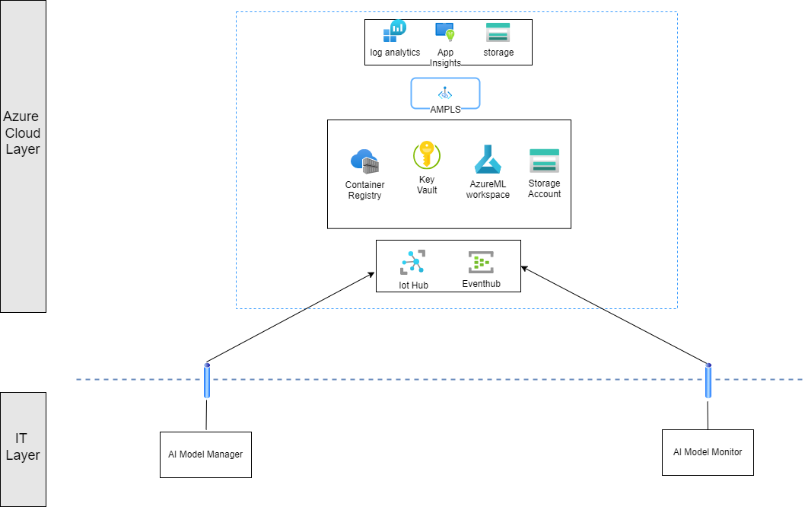
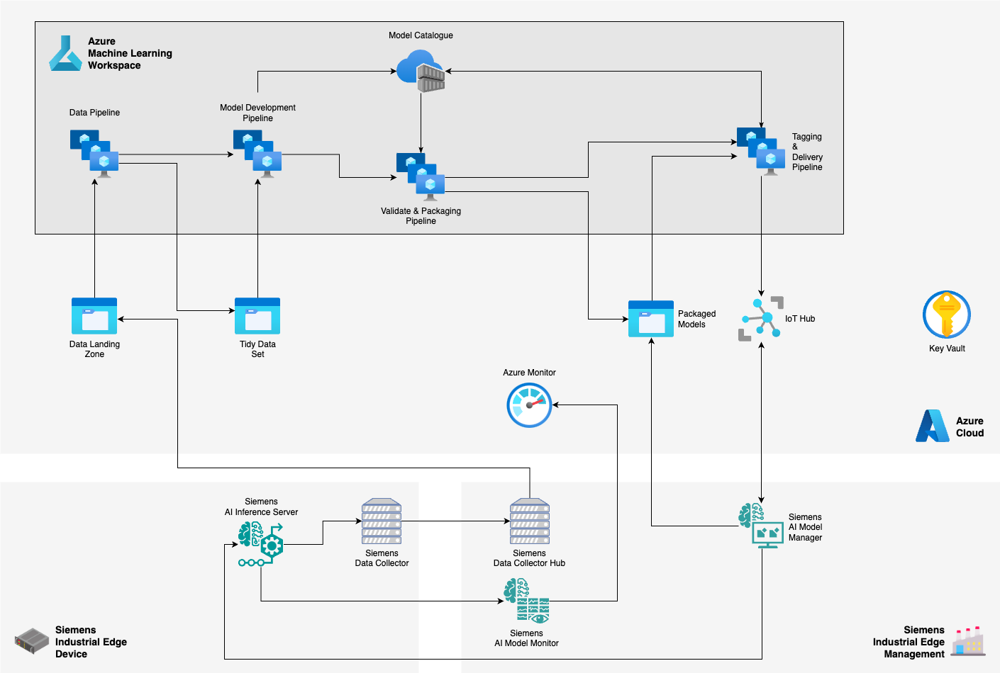

<!--
Copyright (C) 2023 Siemens AG

SPDX-License-Identifier: MIT
-->

# From Zero to Hero
This document explains the steps to take in order to experience the workflow with Siemens Industrial AI Portfolio with a smooth integration with Microsoft Azure Cloud. The process is an example implementation of the [Reference Architecture for Siemens and Microsoft Customers in the Industrial AI Space](https://techcommunity.microsoft.com/t5/azure-architecture-blog/a-reference-architecture-for-siemens-and-microsoft-customers-in/ba-p/4077589) article.

By the end of these steps you will have the infrastructure with all of necessary resources, keys and configurations.


<!--  -->



[[_TOC_]]


## 1. Clone the repository

You can either clone the repository or download as a zip file with all of the contents.  
The command to be used can be found on the top right of the repository main page, or you can find a link or button to download the whole repository in a single zip file.

## 2. Using Visual Studio Code with Dev Container

Prerequisites:
- Visual Studio Code (VS Code)
- Docker service

The development of the project has been done using `VS Code`, which allows you to use our development enviroment saved as a [`devcontainer`](https://code.visualstudio.com/docs/devcontainers/containers).
This feature available on `VS Code` is based on docker container and will build a docker image from the given definition done inside the folder [.devcontainer](.devcontainer).  
Once the project is opened in `VS Code`, the IDE recognizes the folder `.devcontainer` and asks if you want to reopen the project in the devcontainer.  
Chosing the option `Build and Reopen in Container` the VS Code builds a docker image and runs a docker container from this image. Then `VS Code` reopens the project inside the docker container where all required softwares/libraries are installed.  
__Note__: By using VS Code in Windows Subsystem for Linux (WSL), devcontainer usage requires WSL version 2.

## 3. Apply Azure infrastructure

Here we explain the easiest way to create a Resource Group which fulfills all of requirements needed to try our Azure integration to Industrial AI Portfolio ecosystem. For example, the workflow below does not deal with security or CI/CD automation aspects.  
If you are interested in the built options to make the infrastructure more secure or automated, please refer the document [Infrastructure Deployment](./docs/infra/infrastructure_deployment.md).  
Prerequisites:
- `Azure Account`
- `Subscription`
- `Service Principal` with **Contributor** role for the `Account` on the `Subscription`

Once your enviroment is up and you have your credentials in your hands, you are ready to create the infrastructure.

First, you need to define the credentials of your `Service Principal` and the `Subscription` properties as environment variables:

- `ARM_SUBSCRIPTION_ID`: Subscription id from Azure Portal
- `ARM_TENANT_ID`:  Unique identifier assigned to each organization that uses Microsoft services
- `ARM_CLIENT_ID`: Credentials for the Service Principal Authentication
- `ARM_CLIENT_SECRET`: Credentials for the Service Principal Authentication
- `LOCATION`: Azure Location to allocate the used resources

```bash
export ARM_SUBSCRIPTION_ID='arm_subcription_id'
export ARM_TENANT_ID='arm_tenant_id'
export ARM_CLIENT_ID='arm_client_id'
export ARM_CLIENT_SECRET='arm_client_secret'
export LOCATION='location'
```

```
Attention !!!
Never share or commit those values into a code repository, keep those values secret.
```

Now you can login and check wether the active subscription is the intended:

```bash
az login --service-principal \
    --username $ARM_CLIENT_ID \
    --password $ARM_CLIENT_SECRET \
    --tenant $ARM_TENANT_ID

az account show
```

_Note_: In case you do not have a `Service Principal` you also can use your personal account and log in interactively with command `az login`, but later on you need to change the code at some points.

Once you logged in, you need to initialize your backend to store OpentTofu states (tfstate).
You can create the Storage Account with the included bash script [./scripts/opentofu-remote-state.sh](./scripts/opentofu-remote-state.sh) by adding default location and a suffix to resource group name started with `tfstate{suffix}`. These two parameters are optional, by default the script will create a resource group in `westeurope` with name `tsstate`. In the resource group a Storage Account and a Container will be created with names `tfstate{random-string}` and `tfstate`, respectively.

```bash
source scripts/opentofu-remote-state.sh -l ${LOCATION} -e {suffix}
```

The script above creates the required resources and sets the environment variable which are used in the next step, when we initialize and apply the infrastructure using our [./scripts/deploy-infra.sh](./scripts/deploy-infra.sh) bash script.

```bash
bash scripts/deploy-infra.sh \
    --action apply \
    --source testing \
    --location ${LOCATION} \
    --skip-tests

    # --action 'apply' triggers deploying the defined infrastructure
    # --source testing can be used to differentiate the created resources and make them ease-to-find
    # --location ${LOCATION} Azure Location to allocate the used resources
    # --skip-tests with this parameter the script executes some validation tests and creates temporary azure resources
```

Now we have the Azure infrastructure setup using the naming conventions implemented in OpenTofu scripts. For example the **Resource Group** has the name like `rg-{source}-{suffix}` , where:
- `rg` is stated for resource group
- `source` coming from the script parameter
- `suffix` stands for random string auto generated.  

Similarily, the `Azure Machine Learning Workspace` has the name like `mlws-{source}-{suffix}`, where `mlws` is stated for **Machine Learning Workspace**.

```
Copy the output values to a text file, you are going to use them for further configuration steps.
```


## 4. Execute MLOps pipelines

In this step we want to deploy our MLOps pipelines to the Azure Machine Learning Workspace created in the previous step.  
To do so we have to define the Azure environment variables in the related configuration file, eg. '_model_config.json_' and '_delivery_config.json_' define model and delivery related variables respectively. Once the variables are configured as environment variables a Python script is able to use them to create and start the Pipelines.

### Environment definition

If you navigate to the created Azure ML workspace, you can find all related information needed to be configured in the files in the folder [mlops/config](./mlops/config):
- [model configuration](./mlops/config/model_config.json):  
contains information about the `Azure ML Workspace` where the `training` and `packaging` pipelines should be executed.
- [delivery configuration](./mlops/config/delivery_config.json):  
contains information for the pipeline `delivery` which is responsible to deliver a packaged ML Model to a connected `AI Model Manager` application.  
Detailed explanation on the variables can be found in document [gitlab pipelines](./docs/mlops/gitlab_pipelines.md#load_config_variables) under section `load_config_variables`.

With the `jq` command below you can read the configuration and set the environment variables for the model `image_classification`. By changing the index `1` to `0` in the brackets, you can switch to the model `state_identifier`.

```bash
# setting up image classification environment variables
export `jq -r '.[][1]' mlops/config/model_config.json | jq -r "to_entries|map(\"\(.key)=\(.value|tostring)\")|.[]" `
```

Once the commands are successfully executed, you can check if all variables are set by listing the environment variables; using `env` on linux, and `set` on windows systems.
Now the environment variables are all set up and we can execute our MLOps pipelines.
Additionally you might need to define some extra variables, like
- `BUILD_REFERENCE`: a string which is added to your MLOps pipeline and this way you can easily search for the started pipeline in the Azure ML Workspace.
- `ENVIRONMENT_NAME`: you might want to add an extra info to your pipeline

```bash
export BUILD_REFERENCE=experiment-001
export ENVIRONMENT_NAME=dev
```

### Create Data Asset Pipeline

As a Data Scientist or Machine Learning Expert we are dealing with data and we need a storage to store them. With the script below a `Data Asset` can be created in your `Machine Learning Workspace` and then can be explored and studied there.

```bash
python -m mlops.common.pipeline.data_asset_creation_pipeline \
                --subscription_id ${ARM_SUBSCRIPTION_ID} \
                --resource_group_name ${RESOURCE_GROUP_NAME} \
                --workspace_name ${WORKSPACE_NAME} \
                --github_url ${GITHUB_URL} \
                --model_type ${ML_MODEL_CONFIG_NAME} \
                --asset_name_ci ${ASSET_NAME_CI} \
                --asset_name_pr ${ASSET_NAME_PR} \
                --cluster_name ${CLUSTER_NAME} \
                --cluster_size ${CLUSTER_SIZE} \
                --cluster_region ${CLUSTER_REGION} \
                --build_reference ${BUILD_REFERENCE} \
                --deploy_environment ${ENV_NAME} \
                --experiment_name ${EXPERIMENT_BASE_NAME} \
                --display_name data_asset_creation_${ML_MODEL_CONFIG_NAME}_${BUILD_REFERENCE} \
                --environment_name data_asset_creation_${ENVIRONMENT_NAME} \
                --conda_path ${CONDA_PATH} \
                --env_base_image_name ${ENV_BASE_IMAGE_NAME}
```

### Training Pipeline

First, you probably want to create and train a model, check its performance and if the model metrics match your need, that should be registered in the `Model Registry` of the `Azure ML Workspace`.  
This job is done via the python module `mlops_pipeline` and can be triggered with the command below.  

```bash
python -m mlops.${ML_MODEL_CONFIG_NAME}.pipeline.mlops_pipeline \
            --build_reference ${BUILD_REFERENCE} \
            --subscription_id ${ARM_SUBSCRIPTION_ID} \
            --resource_group_name ${RESOURCE_GROUP_NAME} \
            --workspace_name ${WORKSPACE_NAME} \
            --cluster_name ${CLUSTER_NAME} \
            --cluster_size ${CLUSTER_SIZE} \
            --cluster_region ${CLUSTER_REGION} \
            --deploy_environment ${ENV_NAME}  \
            --experiment_name ${EXPERIMENT_BASE_NAME} \
            --display_name training_${ML_MODEL_CONFIG_NAME} \
            --wait_for_completion True \
            --environment_name training_${ENVIRONMENT_NAME} \
            --env_base_image_name ${ENV_BASE_IMAGE_NAME} \
            --model_name ${MODEL_BASE_NAME} \
            --conda_path ${CONDA_PATH} \
            --update_env True \
            --output_file run_id.txt \
            --asset_name ${ASSET_NAME_PR}
```

Once the pipeline is executed, you can check the results in the `Pipelines` menu item of `Azure ML Studio`.  
The result of the succesful pipeline is a registered `Model` in the `Model Registry` of `Azure ML Workspace`.
More details on the Pipeline can be found in document [MLOps Training Pipeline](./docs/mlops/mlops_training_pipeline.md).


### Packaging Pipeline

Once you have the model created and trained, you should create an `Inference Pipeline` in order to deploy it to your `AI Model Manager` and then import it into `AI Inference Server` and have it running.  

Here we also have some extra parameters to add:
```bash
export MODEL_NAME='my-model'
export MODEL_VERSION='1'
export PACKAGE_NAME='my-package'
```
On this purpose we also have a Python script which does the job and your only task is to set the required parameters as we did in the previous `MLOps Pipeline`.
```bash
python -m mlops.common.pipeline.packaging_pipeline \
            --build_reference ${BUILD_REFERENCE} \
            --subscription_id ${ARM_SUBSCRIPTION_ID} \
            --resource_group_name ${RESOURCE_GROUP_NAME} \
            --workspace_name ${WORKSPACE_NAME} \
            --cluster_name ${CLUSTER_NAME} \
            --cluster_size ${CLUSTER_SIZE} \
            --cluster_region ${CLUSTER_REGION} \
            --deploy_environment ${ENV_NAME}  \
            --experiment_name ${EXPERIMENT_BASE_NAME} \
            --display_name packaging_${ML_MODEL_CONFIG_NAME} \
            --wait_for_completion True \
            --environment_name packaging_env \
            --model_type ${ML_MODEL_CONFIG_NAME} \
            --model_name ${MODEL_NAME} \
            --model_version ${MODEL_VERSION} \
            --package_name ${PACKAGE_NAME} \
            --conda_path mlops/common/environment/packaging/conda.yml \
            --raw_data ${ASSET_NAME_PR} \
            --output_file run_id.txt \
            --update_env True
```

Once the pipeline is successfully executed, you can check the results in the `Pipelines` menu item of `Azure ML Studio`.  
The result of the succesfful pipeline is registered `Pipeline Package` in the `Model Registry` of `Azure ML Workspace`.
More details on the Packaging pipeline can be found in document [Model Packaging](./docs/handover/mlops/model_packaging.md).

### Package Delivery Pipeline

When the `Edge Package` is created and tested, you can deploy it to `AI Model Manager`.  
Before you also need to connect your `AI Model Manager` to the created `IoT Hub`. To do so please refer to the section [Onboard AI Model Manager](#ai-model-manager) in [Shopfloor requirements](#shopfloor-requirements).

Here we also have some extra parameters to define:

First, adjust the [mlops/config/delivery_config.json](mlops/config/delivery_config.json) file values:
- `IOT_HUB_CONNECTION_STRING_SECRET_NAME_DELIVERY`: iotmngmt-iothub-primary-connection-string-<resource_group_suffix>
- `EVENT_HUB_CONNECTION_STRING_SECRET_NAME_DELIVERY`: iotmngmt-iothub-eventhub-compatible-endpoint-<resource_group_suffix>
- `DEVICE_ID`: <iot_device_name>
- `PACKAGE_VERSION`: <edge_package_version>

Run the command below to set the environment variables:

```bash
export `jq -r '.[][0]' mlops/config/delivery_config.json | jq -r "to_entries|map(\"\(.key)=\(.value|tostring)\")|.[]" `
```

Trigger the delivery pipeline:

```bash
python -m mlops.common.pipeline.delivery_pipeline \
            --build_reference ${BUILD_REFERENCE} \
            --subscription_id ${SUBSCRIPTION_ID} \
            --resource_group_name ${RESOURCE_GROUP_NAME} \
            --workspace_name ${WORKSPACE_NAME} \
            --cluster_name ${CLUSTER_NAME} \
            --cluster_size ${CLUSTER_SIZE} \
            --cluster_region ${CLUSTER_REGION} \
            --experiment_name ${EXPERIMENT_BASE_NAME} \
            --display_name delivery_${ML_MODEL_CONFIG_NAME} \
            --wait_for_completion True \
            --update_env True \
            --env_base_image_name ${ENV_BASE_IMAGE_NAME_DELIVERY} \
            --conda_path ${CONDA_PATH_DELIVERY} \
            --environment_name delivery_${ENVIRONMENT_NAME} \
            --keyvault_name ${KEYVAULT_NAME} \
            --iot_hub_connection_string_secret_name ${IOT_HUB_CONNECTION_STRING_SECRET_NAME_DELIVERY} \
            --event_hub_connection_string_secret_name ${EVENT_HUB_CONNECTION_STRING_SECRET_NAME_DELIVERY} \
            --device_id ${DEVICE_ID} \
            --output_file run_id.txt \
            --edge_package_name ${PACKAGE_NAME} \
            --edge_package_version ${PACKAGE_VERSION} \
            --deploy_environment ${ENV_NAME}
```

The successful Pipeline will manage the messaging between `IoT Hub` and `AI Model Manager` in order to download the package created above.  
More details on the Model Delivery pipeline can be found in document [Model Delivery](./docs/handover/mlops/model_delivery.md).

## 5. Industrial AI Applications
Before you can deploy and run an `Inference Pipeline`, you need to install the required Siemens Industrial AI Applications on IT and OT level. You will need `AI Inference Server` to execute the Pipeline, `AI Model Monitor` to collect metrics and logs that can be uploaded to the Azure Cloud and `AI Model Manager` who takes care of downloading and importing `Pipeline Packages` from Azure Cloud to `AI Inference Server`.

### AI Inference Server

`AI Inference Server` is the *Edge Application* you have on your Operation side and runs the Pipeline created above. This *Application* should be already connected to your `AI Model Manager`, so the *Model Manager* is able to import *Pipeline Package* to *AI Inference Server*.  
More details on how to install and manage *AI Inference Server* with *AI Model Manager* can be found in the User Manual of the Edge applications.

### AI Model Manager

[AI Model Manager](https://www.dex.siemens.com/edge/build-your-solution/ai-model-manager): Lets you keep track of all AI model deployments on Edge. Configure automated model downloads and deployment from cloud of AI providers to ease and speed up the integration of AI Models on the shop floor.

`AI Model Manager` establihes the communication with *Azure IoT Hub*, downloads *Pipeline packages* and imports them into *AI Inference Server*.  In order to have the communication between Model Manager and Azure IoT Hub ensured and secured, you need to have a certificate for the chosen *AI Model Manager*, register the device in IoT Hub, and register a `Workspace` in *AI Model Manager* with all of the information about the communication.

The jobs of `Onboarding workflow` can be done with bash script [create_model_manager_identity.sh](./devops/pipeline/az_cli_scripts/create_model_manager_identity.sh) by giving the required parameters:

```bash
export IOT_HUB_NAME='iot_hub_name'
export DEVICE_ID='device_id'

./devops/pipeline/az_cli_scripts/create_model_manager_identity.sh \
    -s ${ARM_SUBSCRIPTION_ID} \
    -k ${KEYVAULT_NAME} \
    -S true \
    -h ${IOT_HUB_NAME} \
    -r G2 \
    -d ${DEVICE_ID} \
    -b ${build_number}
```

Parameters info:
- `-s  <arm_subcription_id>`
- `-k  <keyvault_name>`
- `-S  <true/false>`  Defines the way we want to identify the *Edge Application*. When it is set to `true` we define that we want to use *Self Signed Certificate* to identify the **AI Model Manager Workspace**
- `-h  <iot_hub_name>` Iot Hub name created by the deploy-infra.sh script
- `-r  <certificate_authority>` The name of the Certificate Authority to be used for the certificate generation, like **'G2'** for "DigiCert Global Root G2 ceritificate" in our case
- `-d <device_id>` IoT Hub Device Name that will identify the AI Model Manager and it will be used on the Azure ML Pipelines to execute the delivery
- `-b <build_number>` (Optional) is a extra information that can be used when running in a CI/CD Pipelines

Once the script is has been successfully executed, the required credentials are created and stored in the defined `Key Vault`. The device is registered in ` Azure IoT Hub` and a configuration json is also stored in the `Key Vault`.  

Now you can download this configuration file from `Key Vault` secrets, and create the `Workspace for Azure` in `AI Model Manager`.

```bash
./scripts/get_model_manager_configuration.sh \
    -s ${ARM_SUBSCRIPTION_ID} \
    -k ${KEYVAULT_NAME} \
    -d ${DEVICE_ID} \
    -t ${ARM_TENANT_ID} \
    -c false  # Use Device Code authentication (true / false)
```

When the workspace is connected to `Azure IoT Hub`, you can get back to section [Model Delivery](#pipeline-package-deployment) and download your created `Pipeline Package`.


### AI Model Monitor

[AI Model Monitor](https://www.dex.siemens.com/edge/build-your-solution/ai-model-monitor): AI Model Monitor is an integrated module for AI Model Manager that tracks inference performance, detects HW and SW issues and helps you to evaluate data quality metrics and potential data & performance drifts.

Similarly to `AI Model Manager`, `AI Model Monitor` also uses a secured communication channel to upload its collected metrics to the Cloud.

The detailed description about *How to onboard AI Model Monitor* can be found in document [Model Monitor Certificate Generation](./docs/certificates/ai_model_monitor_certificate_generation.md).

The jobs of `Onboarding workflow` can be done with bash script [create_model_monitor_identity.sh](./devops/pipeline/az_cli_scripts/create_model_monitor_identity.sh) by giving the required parameters:

```bash
export MODEL_MONITOR_DEVICE_ID='model_monitor_device_id'
export ARM_MONITOR_CLIENT_ID='arm_model_monitor_client_id'

create_model_monitor_identity.sh \
    -s ${ARM_SUBSCRIPTION_ID}  \
    -k ${KEYVAULT_NAME}  \
    -S true   \
    -t ${ARM_TENANT_ID} \
    -d ${MODEL_MONITOR_DEVICE_ID} \
    -c ${ARM_MODEL_MONITOR_CLIENT_ID} \
    -b ${buildNumber}
```

Parameters info:
- `-d  <model_monitor_device_id>`  Is the name of the device representing the IT Level AI Model Monitor application, that will be responsible to send data from the Edge to the `Azure Monitor`
- `-c  <arm_model_monitor_client_id>`  AI Model Monitor needs its own App Registration client_id in order to connect to Azure Monitor


The script will generates the certificates in Azure, store them in Azure Key vault and can be downloaded via script [get_model_monitor_configuration.sh](./scripts/get_model_monitor_configuration.sh).

```bash
get_model_monitor_configuration.sh
    -s ${ARM_SUBSCRIPTION_ID}
    -k ${KEYVAULT_NAME}
    -d ${MODEL_MONITOR_DEVICE_ID}
    -t ${ARM_TENANT_ID}
    -c true  # Use Device Code authentication (true / false)
```

For `AI Model Monitor`, the required credentials can be read from the file and the *Edge Application* can be configured as it is described in its User Manual. By starting the `AI Model Monitor`, the metrics start to be uploaded to the Azure Cloud, and can be investigated.
