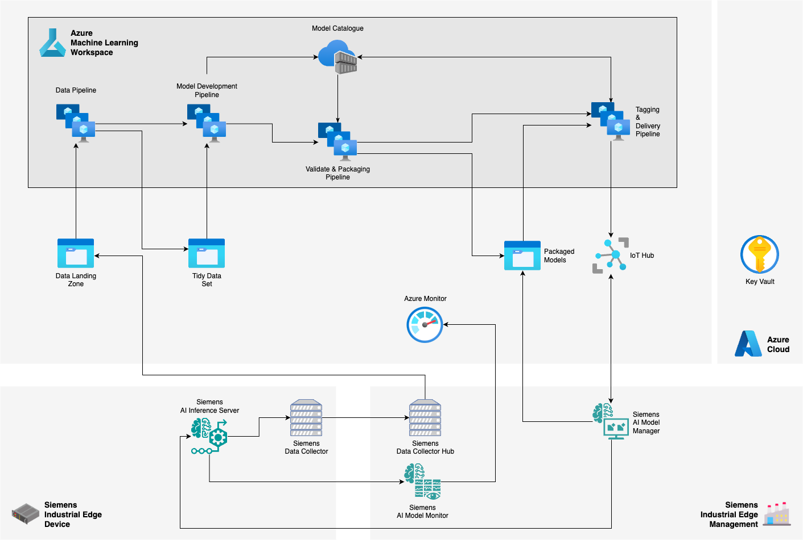

<!--
Copyright (C) 2023 Siemens AG

SPDX-License-Identifier: MIT
-->

# Reference Architecture for Industrial AI on Azure

This document explains the steps to take in order to experience the workflow with Siemens Industrial AI Portfolio with a smooth integration with Microsoft Azure Cloud. The process is an example implementation of the [Reference Architecture for Siemens and Microsoft Customers in the Industrial AI Space](https://techcommunity.microsoft.com/t5/azure-architecture-blog/a-reference-architecture-for-siemens-and-microsoft-customers-in/ba-p/4077589) article.

By the end of these steps you will have the infrastructure with all necessary resources, keys and configurations.

## Getting started

Following the steps described in [Getting Started](GettingStarted.md) document, you can learn how to connect your Industrial AI Edge applications to the Azure Cloud services, and how to fulfill an MLOps workflow from ML Model creation and training to the step of Monitoring your AI Model on the shopfloor.

Our [Getting Started](./GettingStarted.md) document covers the steps of how to
- [Architecture Overview](./GettingStarted.md#1-architecture-overview)
- [Requirements](./GettingStarted.md#2requirements)
- [Apply Azure Infrastructure](./GettingStarted.md#3-apply-azure-infrastructure)
- [Execute MLOps pipelines](./GettingStarted.md#4-execute-mlops-pipelines)
- connect your Industrial AI Applications
    - [AI Inference Server](./GettingStarted.md#ai-inference-server)
    - [AI Model Manager](./GettingStarted.md#ai-model-manager)
    - [AI Model Monitor](./GettingStarted.md#ai-model-monitor)

## Architecture Overview
This representation shows how Siemens Industrial AI applications can be used in cooperation with Azure Cloud. The specific configurations of these applications and resources will be detailed in this repository:

## Contribution

Thank you for your interest in contributing. Anybody is free to report bugs, unclear documentation, and other problems regarding this repository in the Issues section.

If you haven't previously signed the [Siemens Contributor License Agreement](https://cla-assistant.io/industrial-edge/) (CLA), the system will automatically prompt you to do so when you submit your Pull Request. This can be conveniently done through the CLA Assistant's online platform. Once the CLA is signed, your Pull Request will automatically be cleared and made ready for merging if all other test stages succeed.

## License and Legal Information

Please read the [Legal information](LICENSE.md).
