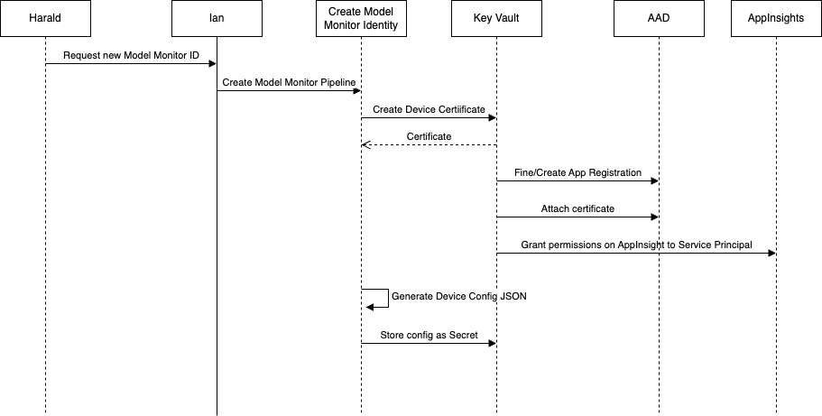
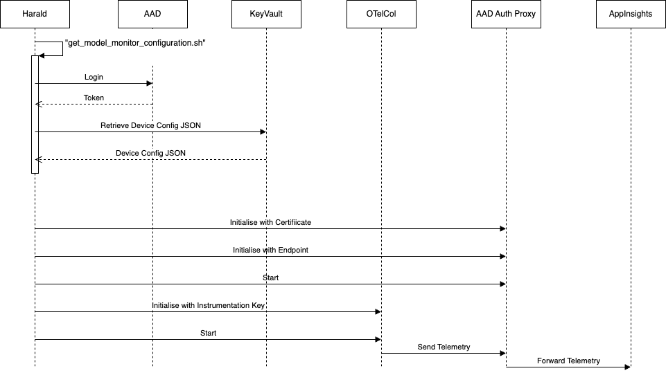

# AI Model Monitor Certificate Generation

The [Observability Architecture](../observability/observability_architecture.md) requires a certificate to be created for each AI Model Monitor instance. The certificate is associated with a Service Principal in AAD (Entra ID)and is used by the [AAD Authentication Proxy](https://github.com/Azure/aad-auth-proxy) to claim a bearer token representing the Service Principal's identity. This allows all traffic from the AI Model Monitor (OpenTelemetry Collector's Azure Monitor Exporter component) flowing to Application Insights in Azure to carry an AAD based identity and thus be authenticated in Azure.

During the Phase 2 ADS Sessions, a list of requirements were drawn up for the process to create the Service Principal and associated certificate. The process is partly described in terms of two personas Harald and Ian.

Harald is an automation engineer in the factory and is responsible for the installation of AI Model Monitor.

Ian is an IT Administrator, outside of the factory, and can perform some privileged tasks.

The requirements are:

1. Generate certificates outside the factory
1. Distribute certificates/config to the factory securely
1. One certificate per Model Monitor
1. Harald to have least privileges
1. Ian to have minimum required privileges
1. Automate as much of the process as possible
1. Have no unmanaged services running in Azure

## Certificate Generation Process

The following sequence diagram shows the main process flow.

1. Harald requests a new Model Monitor Identity (outside the scope of this work, could be email, teams, ticket system etc).

1. Ian receives the request and, assuming he is satisfied with it, initiates the `Create Model Monitor Identity" ADO pipeline. The Pipeline runs in its own Service Principal identity that has the permissions required to undertake the actions it performs. This means Ian does not need to have those permissions himself.

1. The Pipeline requests a new certificate to be created by KeyVault.

1. KeyVault creates and stores the certificate.

1. The Pipeline retrieves the certificate.

1. The next step has a choice in it. In some organisations, e.g. Siemens, the generation of a new AAD Service Principal may need to occur outside this Pipeline. In this case, the tenant_id and client_id of the already existing Service Principal will be passed into the pipeline as parameters. These will be used to find the existing Service Principal. In other organisations, the Pipeline will create a new Service Principal representing the new Model Monitor identity. This supports the three major use cases defined below.

1. The Pipeline will attach the newly generated certificate to the Service Principal.

1. The Pipeline will grant Monitoring Metrics Publisher permission to the new Service Principal in Application Insights.

1. The Pipeline create a Json configuration object containing all the information required to configure Model Monitor.

1. This Json configuration is stored in KeyVault as a secret.

### Notes

The `create_model_monitor_identity.sh` script that implements this process takes a flag `-S` to indicate whether to use Self-Signed Certificates in KeyVault (`true`), or a Certificate Authority based one (`false`). Currently only the self-signed pathway is implemented.

Details of the command line for the script and the sub-scripts it calls can be found in this [Readme](../../devops/pipeline/az_cli_scripts/README.md).

### Major use cases

There are three major use cases for the `create_model_monitor_identity.sh` script based upon whether the script is allowed to create a new Service Principal or not. Each use case is briefly described here, along with the command line arguments required to implement it.

##### New Service Principal

This is the simplest case and for each identity being created, a new Service Principal is created in the AAD tenant. This is NOT the scenario to use in the Siemens tenant where generation of Service Principals like this is not allowed.

| Option | Value | Explanation |
|--------|-------|--------------|
| -c | {none} | Do not use this flag, a new Service Principal will be generated |
| -a | false | Do not append credentials. Not really an issue as the credential list is empty upon creation |

##### Use Existing Service Principal - single identity

To be used when the Service Principals for the Identities are created in a separate process, but it is still a 1-1 mapping from Model Monitor Identity to Service Principal.

| Option | Value | Explanation |
|--------|-------|--------------|
| -c | {clientId} | Finds and uses the Service Principal with this ClientId |
| -a | false | Do not append credentials. Not really an issue as the credential list is empty upon creation |

##### Use Existing Service Principal - multiple identities

To be used when there is only a single Service Principal representing multiple Model Monitor Identities. This is the default Siemens tenant case.

| Option | Value | Explanation |
|--------|-------|--------------|
| -c | {clientId} | Finds and uses the Service Principal with this ClientId |
| -a | true | Appends the newly created certificate/credential to the list already on the service principal. |

## Certificate Distribution Process

One of the requirements for this work is to "Distribute certificates/config to the factory securely". This means Ian cannot simply download the configuration data from Azure KeyVault and email it to Harald. Instead, another script - `get_model_monitor_configuration.sh` is provided. Harald runs this script (details of command line arguments can be found in this [Readme](../../scripts/README.md)).

The configuration process can be seen in this sequence diagram.

1. Once Harald has been notified that his request has been satisfied, he runs the `get_model_monitor_configuration.sh` script
1. He is asked to Log In to Azure
1. A token is returned that is used in subsequent calls
1. The script requests the Json configuration data stored as a secret in KeyVault
1. The Json configuration is returned
1. The script writes the configuration json to a local file and exits

The remaining steps are shown here for logical completion, but are not implemented as part of the script.

### Notes

An issue with this approach is that Harald requires "Get Secrets" permission on the KeyVault, so is not truly minimally privileged. There is a tension between Requirements 4 & 7. For Harald to have no privileges in KeyVault, some other system component needs to be able to get secrets on his behalf. This could be implemented as an Azure hosted API (WebApp, Container, Function etc) but this contradicts requirement 7 stating there should be no custom software running in Azure.

Thoughts on how to improve this situation can be found in the project [Wiki](https://dev.azure.com/siemens-microsoft-iai/Siemens-Microsoft-IAI/_wiki/wikis/Siemens-Microsoft-IAI.wiki/95/001-KeyVault-Improvements).
