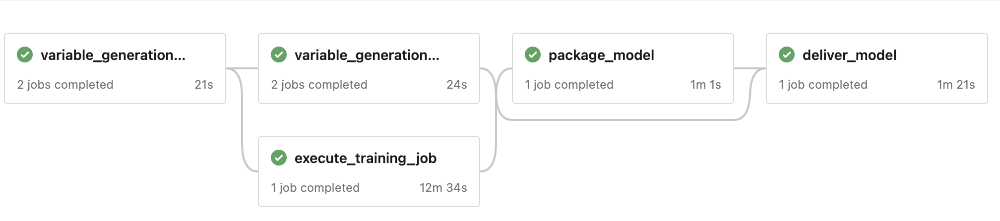
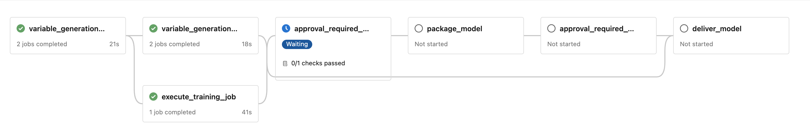

# Azure DevOps Pipelines for Code Quality and Model Training

- [Azure DevOps Pipelines for Code Quality and Model Training](#azure-devops-pipelines-for-code-quality-and-model-training)
  - [Overview](#overview)
  - [PR Dev Pipelines](#pr-dev-pipelines)
    - [File execution flow for PR](#file-execution-flow-for-pr)
  - [CI Dev Pipelines](#ci-dev-pipelines)
    - [File execution flow for CI](#file-execution-flow-for-ci)
  - [Trigger Paths](#trigger-paths)
  - [Parameters](#parameters)
  - [Pipeline Stages](#pipeline-stages)
    - [Manual Approval process](#manual-approval-process)
  - [Templates](#templates)
    - [variables\_template\_training\_and\_packaging.yml](#variables_template_training_and_packagingyml)
    - [variables\_template\_delivery.yml](#variables_template_deliveryyml)
    - [experiment\_variables.yml](#experiment_variablesyml)
    - [get\_connection\_details.yml](#get_connection_detailsyml)
    - [configure\_azureml\_agent.yml](#configure_azureml_agentyml)
    - [execute\_mlops\_pipeline.yml](#execute_mlops_pipelineyml)
  - [Conclusion](#conclusion)

## Overview

This documentation provides an in-depth look at the CI and PR Azure DevOps pipelines: `state_identifier_ci_dev_pipeline.yml`, `image_classification_ci_dev_pipeline.yml`,  `state_identifier_pr_dev_pipeline.yml` and `image_classification_pr_dev_pipeline.yml`. These pipelines help maintain code quality and ensure the effectiveness of the Azure ML experiments and model training processes. This document also expands on the templates involved in the execution.  
The pipelines use the variable group `vg-az-client`, which is managed from Azure DevOps, and can be found by navigating to Pipelines -> Library.  
In both PR and CI ppelines, the model is delivered to a test device registered in IoT Hub.

## PR Dev Pipelines

This pipeline is designed to ensure code quality for all commits.
We have two PR pipelines, one for each implemented use case: [`state_identifier_pr_dev_pipeline.yml`](../../../devops/pipeline/state_identifier_pr_dev_pipeline.yml) and [`image_classification_pr_dev_pipeline.yml`](../../../devops/pipeline/image_classification_pr_dev_pipeline.yml).  
PR pipelines use a toy data asset, which is based on a subset of the complete dataset. The name of the data asset used is set in `ASSET_NAME_PR` in [model_config.json](../../../mlops/config/model_config.json) file.
A PR pipeline is triggered for every commit on a feature branch.

### File execution flow for PR

When a PR dev pipeline is executed, the following files are called:

- `{model_name}_pr_dev_pipeline.yml`: contains yaml code for the Azure DevOps pipeline, specific for the model use case. Model name is either 'state_identifier' or 'image_classification'.
- [`variables_template_training_and_packaging.yml`](#variables_template_training_and_packagingyml): loads the config variables from [model_config.json](../../../mlops/config/model_config.json).
- [`variables_template_delivery.yml`](#variables_template_deliveryyml): loads the config variables from [`delivery_config.json`](../../../mlops/config/delivery_config.json).
- [`platform_pr_dev_pipeline.yml`](../../../devops/pipeline/platform_pr_dev_pipeline.yml): contains the common code for the PR pipelines, which defines the stages for training, packaging and delivery. It makes use of the following templates: [`experiment_variables.yml`](#experiment_variablesyml), [`get_connection_details.yml`](#get_connection_detailsyml), [`configure_azureml_agent.yml`](#configure_azureml_agentyml), [`execute_mlops_pipeline.yml`](#execute_mlops_pipelineyml).
- `mlops.{model}.pipeline.mlops_pipeline.py`: called in the execute training step, this file is specific implementation for the model use case.
- [`mlops.common.pipeline.packaging_pipeline.py`](../../../mlops/common/pipeline/packaging_pipeline.py): called in the packaging step.
- [`mlops.common.pipeline.delivery_pipeline.py`](../../../mlops/common/pipeline/delivery_pipeline.py): called in the package delivery step.

## CI Dev Pipelines

The primary role for CI pipelines is to execute model training on the full dataset, generating a model suitable as a production candidate.
We have 2 CI pipelines, one for each implemented use case: [`state_identifier_ci_dev_pipeline.yml`](../../../devops/pipeline/state_identifier_ci_dev_pipeline.yml) and [`image_classification_ci_dev_pipeline.yml`](../../../devops/pipeline/image_classification_ci_dev_pipeline.yml).  
CI pipelines use the complete data asset, the name of the data asset is set in `ASSET_NAME_CI` in [model_config.json](../../../mlops/config/model_config.json) file.
This pipeline triggers once a new PR has been merged into the development branch. A CI pipeline has two additional stages comparing to the PR pipeline, which are the manual approvals stages before the execution of both model packaging and delivery.

### File execution flow for CI

Execution flow for state identifier CI dev pipeline:

- `{model_name}_ci_dev_pipeline.yml`: contains yaml code for the Azure DevOps pipeline, specific for the model use case. Model name is either 'state_identifier' or 'image_classification'.
- [`variables_template_training_and_packaging.yml`](#variables_template_training_and_packagingyml): loads the config variables from [model_config.json](../../../mlops/config/model_config.json).
- [`variables_template_delivery.yml`](#variables_template_deliveryyml): loads the config variables from [`delivery_config.json`](../../../mlops/config/delivery_config.json).
- [`platform_ci_dev_pipeline.yml`](../../../devops/pipeline/platform_ci_dev_pipeline.yml): contains the common code for the CI pipelines which defines the stages for training, packaging, delivery and approvals. It makes use of the following templates: [`experiment_variables.yml`](#experiment_variablesyml), [`get_connection_details.yml`](#get_connection_detailsyml), [`configure_azureml_agent.yml`](#configure_azureml_agentyml), [`execute_mlops_pipeline.yml`](#execute_mlops_pipelineyml).
- `mlops.{model_name}.pipeline.mlops_pipeline.py`: called in the execute training step, this file is specific implementation for the model use case.
- [`mlops.common.pipeline.packaging_pipeline.py`](../../../mlops/common/pipeline/packaging_pipeline.py): called in the packaging step.
- [`mlops.common.pipeline.delivery_pipeline.py`](../../../mlops/common/pipeline/delivery_pipeline.py): called in the package delivery step.

## Trigger Paths

CI and PR pipelines will be triggered for changes under any of the following paths, regardless of the model:

- `devops/*`
- `mlops/common/*`
- `test/mlops/common/*`  

Trigger paths specific to state identifier use case:

- `test/mlops/state_identifier/*`
- `mlops/state_identifier/*`

Trigger paths specific to image classification use case:

- `test/mlops/image_classification/*`
- `mlops/image_classification/*`

## Parameters

The parameters used in CI and PR pipelines are:

- **deploy_env**: specifies the environment where the deployment should take place. Default value is set to 'dev'.
- **model_type**: the type of model to execute. This will be either `state_identifier` or `image_classification` depending on the case.
- **model_name**: the exact name of the model that should be executed.
- **target_device_id**: the name of the target IoT device to which the model will be delivered to. This is a device registered in IoT Hub.
- **pipeline_type**: the type of the pipeline to execute. The value will be either "PR" or "CI" depending on the case.

## Pipeline Stages

1. **Variable generation for training and packaging**: utilizes the [`variables_template_training_and_packaging.yml`](#variables_template_training_and_packagingyml) template.
2. **Variable generation for delivery**: utilizes the [`variables_template_delivery.yml`](#variables_template_deliveryyml) template.
3. **Model Training**  
The `execute_training_job` stage is responsible for executing the machine learning training job.
This stage depends on the successful completion of the `variable_generation_training_and_packaging` stage. The variables for this stage are derived from the [`experiment_variables.yml`](#experiment_variablesyml) template.  
`Execute_ml_Job_Pipeline` job executes the following steps:
   - Get Connection Details: Utilizes the [`get_connection_details.yml`](#get_connection_detailsyml) template to fetch Azure connection details.
   - Configure Azure ML Agent: Utilizes the [`configure_azureml_agent.yml`](#configure_azureml_agentyml) template to set up the Azure ML agent.
   - Execute MLOps Pipeline: Based on the [`execute_mlops_pipeline.yml`](#execute_mlops_pipelineyml) template. It runs the machine learning pipeline script with several parameters, including subscription details, workspace specifications, experiment details, and environment configurations. The python script is dynamically selected based on the provided model_type. After execution, the script fetches the model name and version and sets them as output variables (MODEL_NAME and MODEL_VERSION) for subsequent stages.

4. **Model Packaging**  
The `package_model` stage focuses on packaging the trained machine learning model. It relies on predefined templates and dynamically-set parameters for operation. Following a successful packaging process, the details of the packaged model are extracted and set as output variables for further use.  
    Dependencies:
   - variable_generation_training_and_packaging
   - execute_training_job
   - approval_required_packaging: Ensures that this stage only runs after necessary approvals have been received.

    Variables involved:
   - MODEL_NAME and MODEL_VERSION: These are fetched from the outputs of the execute_training_job stage.
Additional variables are derived from the [`experiment_variables.yml`](#experiment_variablesyml) template.
   - vg-az-client: A variable group defined in Azure DevOps.

    `run_packaging_job` executes the following steps:
   - Configure Azure ML Agent: Uses the [`configure_azureml_agent.yml`](#configure_azureml_agentyml) template to prepare the Azure ML agent.
   - Execute Packaging Job: Uses the AzureCLI@2 task to execute the Azure ML packaging job.
   - Packaging script: This script packages the trained model by executing mlops.common.pipeline.packaging_pipeline.py using various input parameters like subscription details, workspace information, cluster details, and model specifics.
After packaging, the script fetches the package name and version and sets them as output variables (edge_package_name and edge_package_version) for the delivery stage.

5. **Model Delivery**
The deliver_model stage is responsible for delivering the packaged model to the target device in Azure IoT Hub. This process ensures that the model, once packaged, is correctly deployed to its final destination.  
    Dependencies:
   - package_model
   - variable_generation_delivery
   - approval_required_delivery: This stage will only execute after the necessary approvals are granted.

    Variables:
   - edge_package_name and edge_package_version: These variables fetch the name and version of the packaged model from the output of the package_model stage.
   - Variables from the [`experiment_variables.yml`](#experiment_variablesyml) template are also loaded.

    `run_delivery_job` executes the following steps:
   - Configure Azure ML Agent: Uses the [`configure_azureml_agent.yml`](#configure_azureml_agentyml) template to set up the Azure ML agent.
   - Execute Delivery Job: Uses the AzureCLI@2 task to execute the Azure ML delivery job.
   - Pre-Check: Before executing the delivery, it ensures the target_device_id parameter is set. If not, it terminates the job with an error message.
   - Delivery Script: The packaged model, identified by its name and version, is delivered to the specified target device in Azure IoT Hub by executing the python script mlops.common.pipeline.delivery_pipeline. It requires various input parameters like subscription details, workspace and cluster configurations, and details about the packaged model and target device. The successful delivery of the package to the target device is acknowledged with a confirmation message.

### Manual Approval process

The CI pipelines contains two stages for manual approval: 'approval_required_packaging' and 'approval_required_delivery'. The reasoning for the manual intervention is that it gives the chance to an authorised person to analyze a model and decide whether or not it should be packaged or delivered to a device. An email is automatically sent to a list of potential approvers when the stage is executed and the pipeline will only resume its execution after an approval is granted.
More information on how approvals are configured can be found here: [Define approvals and checks](https://learn.microsoft.com/en-us/azure/devops/pipelines/process/approvals?view=azure-devops&tabs=check-pass).

## Templates

### variables_template_training_and_packaging.yml

This template uses a powerhsell script to load the configuration variables from the [model_config.json](../../../mlops/config/model_config.json) JSON file and assigns them to environment variables.  

Parameters:

- deploy_env: Represents the deployment environment.
- model_type: Specifies the type of model that needs to be executed.
- pipeline_type: Determines the type of pipeline being executed (CI/PR).

Depending on the value of the pipeline_type, an ASSET_NAME variable is set, choosing either the CI or PR specific asset name from the configuration.
If ML_MODEL_CONFIG_NAME variable has not been set it will exit with an error. If the variable is available, it confirms that variables were loaded from the configuration file and then prints all environment variables for verification.

### variables_template_delivery.yml

This template is responsible for generating and validating variables specific to model delivery.
A powershell script is used to read the configuration JSON file [`delivery_config.json`](../../../mlops/config/delivery_config.json).
If the RESOURCE_GROUP_NAME_DELIVERY variable is not set, it throws an error. If the variable exists, it confirms its availability and then prints all environment variables for verification.

### experiment_variables.yml

This template defines the variables present in configuration outputs of `variable_generation_training_and_packaging` and `variable_generation_delivery` stages. These variables are created to dynamically obtain configuration values during pipeline execution.

Training and Packaging Variables:  
**ML_MODEL_CONFIG_NAME**: The configuration name for the machine learning model.  
**EXPERIMENT_BASE_NAME**: The base name of the ML experiment.  
**ENVIRONMENT_NAME**: Name of the environment where the training and packaging processes will be executed.  
**ENV_BASE_IMAGE_NAME**: Base image name that will be used for the environment.  
**DISPLAY_BASE_NAME**: Base name used for display purposes.  
**CONDA_PATH**: The path to the Conda environment configuration.  
**CLUSTER_SIZE**: Specifies the size of the cluster to be used.  
**CLUSTER_REGION**: Specifies the region where the cluster is located.  
**CLUSTER_NAME**: Name of the cluster where training and packaging will occur.  
**MODEL_BASE_NAME**: Base name of the model.  
**KEYVAULT_NAME**: Name of the Azure Key Vault being used.  
**REGISTRY_NAME**: Name of the registry where artifacts and dependencies will be stored.  
**RESOURCE_GROUP_NAME**: Name of the Azure Resource Group.  
**WORKSPACE_NAME**: Specifies the Azure Machine Learning workspace name.  
**EXPERIMENT_NAME**: Name of the specific experiment.  
**DISPLAY_NAME**: Name used for display purposes.  
**MODEL_NAME**: Specifies the name of the machine learning model.  
**AZURE_RM_SVC_CONNECTION**: Azure Resource Manager service connection name.  
**PACKAGE_NAME**: Specifies the name of the package.  
**ASSET_NAME**: Name of the asset.
**ASSET_NAME_CI**: Asset name specifically for Continuous Integration (CI) pipelines.
**ASSET_NAME_PR**: Asset name specifically for Pull Request (PR) pipelines.
**GITHUB_URL**: URL for the associated GitHub repository.  
**VALIDATION_ASSET_NAME**: Name of the asset used for validation purposes.

Delivery Variables:  
**ENV_NAME_DELIVERY**: Name of the environment specific for model delivery.  
**RESOURCE_GROUP_NAME**: Name of the Azure Resource Group tailored for delivery.  
**WORKSPACE_NAME_DELIVERY**: Specifies the Azure Machine Learning workspace name dedicated for delivery.  
**CLUSTER_NAME_DELIVERY**: Name of the cluster specific for model delivery.  
**ENV_BASE_IMAGE_NAME_DELIVERY**: Base image name that will be used for the delivery environment.  
**CONDA_PATH_DELIVERY**: The path to the Conda environment configuration specific for delivery.  
**ENVIRONMENT_NAME_DELIVERY**: Name of the delivery environment.  
**EXPERIMENT_BASE_NAME**: Name of the specific experiment for delivery.  
**KEYVAULT_NAME_DELIVERY**: Name of the Azure Key Vault specific for delivery.  
**IOT_HUB_CONNECTION_STRING_SECRET_NAME_DELIVERY**: Secret name for the IoT Hub connection string tailored for delivery.  
**EVENT_HUB_CONNECTION_STRING_SECRET_NAME_DELIVERY**: Secret name for the Event Hub connection string dedicated for delivery.  
**DISPLAY_NAME_DELIVERY**: Name used for display purposes during model delivery.

### get_connection_details.yml

This template utilizes the AzureCLI@2 task to interact with Azure through the Azure Command-Line Interface (CLI). The main goal is to retrieve the Azure subscription ID from the AZURE_RM_SVC_CONNECTION variable and make it available to subsequent tasks or steps within the pipeline.

### configure_azureml_agent.yml

This template utilizes the AzureCLI@2 to run Azure CLI commands. The goals are to upgrade pip (Python's package installer) and install required Python packages from the requirements file present at 'devops/pipeline/requirements/execute_job_requirements.txt'.

### execute_mlops_pipeline.yml

This template defines a task that uses the Azure CLI to execute a command or set of commands, specifically tailored for Azure Machine Learning (Azure ML) tasks. The exact command to be run by Azure CLI in this step is passed in via the script_parameter.

## Conclusion

By employing these two distinct pipelines, the team can ensure code quality, efficient Azure ML job execution, and the generation of production-ready models.
This documentation provides a comprehensive overview of the two pipelines, their purposes, usage and a description of each template involved.
