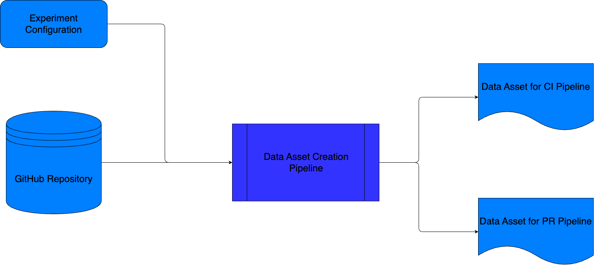
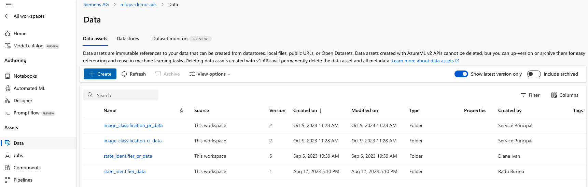

# Data Asset Creation

[[_TOC_]]

This document gives a brief overview of how the data asset creation pipeline works.

## Code Structure

```tree
|-- .devops
|   |-- pipeline
|        |-- data_asset_creation_pipeline.yml
|        |-- templates
|           |-- configure_azureml_agent.yml
|           |-- experiment_variables.yml
|           |-- get_connection_details.yml
|           |-- variables_template_training_and_packaging.yml
|-- mlops
|   |-- common
|       |-- components
|           |-- data_asset_creation.yml
|       |-- pipeline
|           |-- data_asset_creation_pipeline.py
|       |-- src
|           |-- data_asset_creation_utils.py
|   |-- image_classification
|       |-- components
|           |-- deliver.yml
|       |-- environment
|           |-- conda.yml
|       |-- src
|           |-- data_asset_creation
|               |-- data_asset_creation.py
|   |-- state_identifier
|       |-- components
|           |-- deliver.yml
|       |-- environment
|           |-- conda.yml
|       |-- src
|           |-- data_asset_creation
|               |-- data_asset_creation.py
|   |-- config
|       |-- model_config.json
```
## Diagram



## ADO Pipeline

The pipeline is defined in `.devops/pipeline/data_asset_creation_pipeline.yml`. The inputs to the pipeline are as follows:
- `model_type` - you can select `state_identifier` or `image_classification`, depending on the model type for which you want to create the data asset
- `deploy_env` - name of the environment in which you want to deploy (at the moment there is only 1)

 The pipeline has 2 stages:
- **variable_generation_training_packaging** - in which the template `variables_template_training_and_packaging.yml` is used and the following variables are read from `model_config.json`:
    - `subscription_id`, `resource_group_name`, `workspace_name` - details of the AzureML Workspace
    - `github_url` - the GitHub url where the initial datasets are stored
    - `model_type` - type of the model for which the data asset is created
    - `asset_name_ci` - the name under which the data asset is going to be registered for the CI pipeline
    - `asset_name_pr` - the name under which the data asset is going to be registered for the PR pipeline
    - `cluster_name`, `cluster_size`, `cluster_region` - details of the compute used in the experiment
    - `build_reference`, `deploy_environment` - execution information
    - `experiment_name`: `data_asset_creation` by default, the name under which the experiment is going to be registered in AzureML
    - `display_name`: data_asset_creation_model_type_BuildID - the name of the job in AzureML
    - `environment_name` - name of the conda environment used for the execution of the experiment
    - `conda_path` - path to the .yml file that contains the conda environment
    - `env_base_image_name` - name of the Docker image to be used

- **execute_data_asset_creation_job**
    - variables are added to the environment by calling the `experiment_variables.yml` template
    - the `Create_Data_Assets` job is called, which in turn calls the following:
        - the `get_connection_details.yml` and `configure_azureml_agent.yml` templates are called to set the subscription and tenant id and install requirements for the execution of the pipeline
        - the `data_asset_creation_pipeline.py` file is called , which then calls the `data_asset_creation.yml` configuration file from `common`. This component takes as inputs `model_type`, `github_url`, `asset_name_ci`, `asset_name_pr`, `subscription_id`, `resource_group_name`, `workspace_name`, `subsample_percentage`. Depending on `model_type`, the `data_asset_creation.py` file from the corresponding model type folder is called.
    - the new data assets can be found in the Data tab in AzureML with the names specified in `model_config.json` under `asset_name_ci` and `asset_name_pr`.



## Files Involved

### `data_asset_creation_pipeline.py`

This file is very similar to `mlops_pipeline.py`, as it contains the code necessary to create a pipeline in AzureML. It contains the `data_asset_creation_pipeline` function, which contains the input-output mapping for the sole component of the pipeline, which is defined in `data_asset_creation.yml`. The `construct_pipeline` function loads the component and creates the pipeline job. In the `prepare_and_execute` function the environment is created using the `get_environment` function, the `construct_pipeline` function is called and the pipeline is submitted for execution using the `execute_pipeline` function. The `main` function calls the `prepare_and_execute` function.

### `data_asset_creation.py`

This file is different for each use-case.

### state-identifier

In this file the `download_file` function is defined, which downloads a parquet file from GitHub to a local file. The `create_subsample_parquet` function takes in a dataframe and a percentage and creates a subsample of the dataframe containing only the given percentage of the initial data. Then a parquet file containing the subsampled data is created at the specified path. The `main` function calls the MLClient, creates a temporary directory, and calls the `download_file` and `create_subsample_parquet` functions. The resulting parquet files are then uploaded to the AzureML using the `create_data_asset` function, stored in the `mlops/common/src/data_asset_creation_utils.py` folder.

### image-classification

In this file the `create_subsample_folder` function is defined, which takes the path to the original folder containing the images, the path for the destination subfolder, the percentage of the images to be added to that subfolder. In the `main` function the MLClient is initialized, a temporary directory is created and the images are downloaded using the `tf.keras.utils.get_file `function from the tensorflow distribution. Then the class labels are collected and the subsample folder is created using `create_subsample_folder` and the assets are created in AzureML using the `create_data_asset` method.
