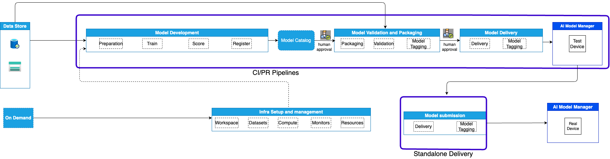
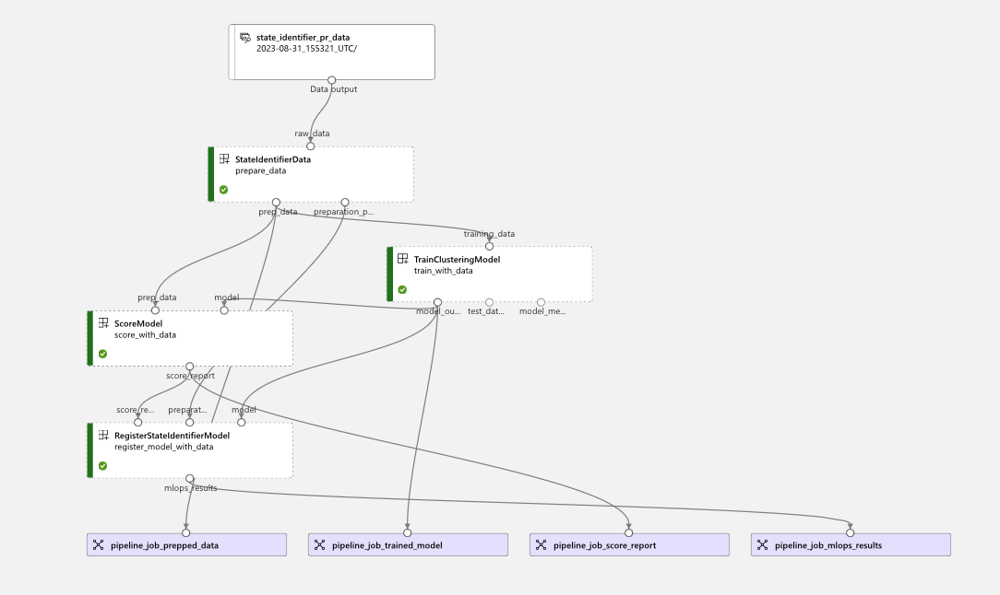

# MLOps Training Pipeline

[[_TOC_]]

This document gives a brief overview of all the processes and files involved in the MLOps training pipelines. In this engagement we have developed 2 use-cases: _State Identifier_ and _Image Classification_. They both share the same structure, which contains the following stages:

- Data Preparation
- Training
- Scoring
- Registration

## Code Structure

All the code can be found in the `mlops` folder of the repository. The code is structured as follows:
- `common` - contains all the code that is shared between the use-cases and the one used for `packaging` and `delivery`
- `image_classification`/`state_identifier` - contains the code for the image classification / state identifier use-cases
    - `components` - contains the code for the `.yml` files used in the pipeline
    - `environment` - contains the configuration file for the conda environment used in the pipeline
    - `src` - contains the `.py` files used in the pipeline
    - `pipeline` - contains the code for the pipeline itself, `mlops_pipeline.py`

## Machine Learning Flow

## mlops_pipeline.py

This python file handles the creation of the pipeline components and the execution of the pipeline. The `main` function parses the arguments received from the `variables_template_training_and_packaging.yml` stage and passes them to the `prepare_and_execute` function.

The arguments to the main function are as follows:
- `subscription_id`, `resource_group_name`, `workspace_name` - AzureML workspace information used for establishing a connection to the workspace
- `cluster_name`, `cluster_size`, `cluster_region` - information about the AzureML compute cluster used for training
- `build_reference` - build number of the ADO pipeline, used for tagging the model
- `experiment_name` - name of the experiment in AzureML
- `environment_name` - Azure Machine Learning Environment name for job execution
- `env_base_image_name` - Docker image used for the execution
- `conda_path` - path to the conda environment file, or the folder where all the requirements for the execution are stored
- `model_name` - name of the model in the Model Catalog
- `asset_name` - the name of the data asset to be used by the pipeline

In the `prepare_and_execute` function the compute clusters and execution environment are created/updated. The compute cluster is selected/created using the `get_compute` function and the execution environment is created using the `get_environment` function. Each time this method is called a new environment is created. Both are defined in the `common` folder. The `construct_pipeline` function is called, which loads all the necessary [components](https://learn.microsoft.com/en-us/azure/machine-learning/concept-component) and data assets. This function also calls `image_classification_job`/`state_identifier_data_regression` function, which creates the structure of the pipeline, as indicated by the `@pipeline` decorator. The `execute_pipeline` function is then called, which executes the pipeline and waits for its completion. This launches a job in AzureML.

A sample execution in AzureML would look as follows:

The input data is stored as [Data Assets](https://learn.microsoft.com/en-us/azure/data-catalog/data-catalog-how-to-manage), which support versioning. These **Data Assets** can be accessed in AzureML by clicking on the **Data** tab in the **Assets** section.

### Components

In the `prepare_and_execute` function the components of the pipeline are created:

- `prepare_data`
  - called by the `prep.yml` config file
  - executes the code from `prep.py`
- `train_with_data`
  - called by the `train.yml` config file
  - executes the code from `train.py`
- `score_with_data`
  - called by the `score.yml` config file
  - executes code from `score.py`
- `register_model`
  - called by the `register.yml` config file
  - executes code from `register.py`

The pipeline has several return values that can be further used. These are then downloaded and used in downstream processes such as packaging and delivery.

Outputs from each component of the pipeline can be used by succeeding components. For instance, the output of the `prepare_data` component can be used by the `train_with_data` component. This is done by passing the output of the `prepare_data` component as an input to the `train_with_data` component, as such `prepare_data.outputs.test_data`. Outputs are written automatically to temporary files in Azure Blob Storage and can be inspected through AzureML.

### Stages

The AzureML pipeline created by the `mlops_pipeline.py` script has 4 stages that are executed sequentially and are shared across the image classification and state identifier use-cases. In this section we will go through each stage and provide a brief explanation of what it does.

#### Prepare Data

This stage is used for data preparation. It takes the input data from the **Data Asset** and performs some transformations on it. The dataset used depends on the type of the pipeline that is being executed. For instance a subset of the data will be used if the pipeline is of the Pull Request type or the entire dataset will be used for the Continuous Integration pipeline. The initial datasets are as follows:

- State-Identifier Use-Case
    - Timeseries data  
    - Location: blob storage
    - number of observations: 42079
    - Timespan: 2h:54m:55s
    - This dataset was collected from an actual device in a Siemens factory
    - No labels

- Image Classification Use-Case
    - Images of Siemens devices
    - Location: blob storage
    - number of observations: 1025
    - Labels: 5 (name of device)

In the *state identifier* case a `sklearn` data preparation pipeline is created which applies a series of transformations to the data, including filling missing values, summarizing columns, windowing, feature extraction, and scaling. This pipeline is then saved as a `joblib` file and uploaded to Blob Storage along with the transformed data and used as inputs for further steps. All the functions used for the generation of this pipeline can be found in `src/prep/preprocessing_utils.py`.

In the *image classification* case the data is split into training and testing sets and resized to specific dimensions. The training set is then used to train the model and the testing set is used to evaluate the model. The data is then uploaded to Blob Storage and used as inputs for further steps.

#### Train with Data

In this stage a model is trained with the data prepared in the previous stage. The model used in the *state_identifier* use case uses the entire dataset, whereas the one for *image classification* uses only the training set.

For the *state_identifier* use-case we are training a [K-Means](https://scikit-learn.org/stable/modules/generated/sklearn.cluster.KMeans.html) model with 3 clusters and for *image_classification* we are using a [MobileNet](https://www.tensorflow.org/api_docs/python/tf/keras/applications/mobilenet/MobileNet) pretrained model on the [ImageNet dataset](https://www.image-net.org) from the [Tensorflow](https://www.tensorflow.org) library. On top of the pre-trained model we are stacking a [Global Average Pooling](https://www.tensorflow.org/api_docs/python/tf/keras/layers/GlobalAveragePooling2D) layer, and a Dense layer the size of the number of classes with [softmax](https://www.tensorflow.org/api_docs/python/tf/nn/softmax) activations. We are only training the layers on top of the MobileNet, the weights of the MobileNet remaining frozen. The model is then trained using the Adam optimizer with the Categorical Cross-entropy loss as an objective for 4 epochs.

The model is logged with `mlflow`, automatically saved in a temporary file and then returned as an output of the stage.

#### Score with Data

This stage is used to evaluate the performance of the model. In the *state identifier* use-case the model is unsupervised so the same data used to train the model will be used to evaluate it. This will be the data resulted from the preprocessing step. Metrics computed for this stage are the **silhouette score**, the **dunn index** and **inertia**.

In the *image classification* use-case unseen testing data is used to evaluate the model. Metrics computed for this model include: accuracy, precision, F1 score, recall and a heatmap of the confusion matrix saved in `PNG` format.

The resulting metrics are logged with `mlflow` to AzureML, automatically saved in a temporary file and then returned as an output of the stage.

#### Register Model

In this stage the model is registered in AzureML with `mlflow`. In the *state identifier* use-case the data transformation pipeline and the trained K-means model are sequenced in a new [sklearn pipeline](https://scikit-learn.org/stable/modules/generated/sklearn.pipeline.Pipeline.html) and registered as a single model. In the *image classification* use-case the trained model is registered as is. The model is tagged in the Model Catalog with the metrics resulted from the scoring step.
