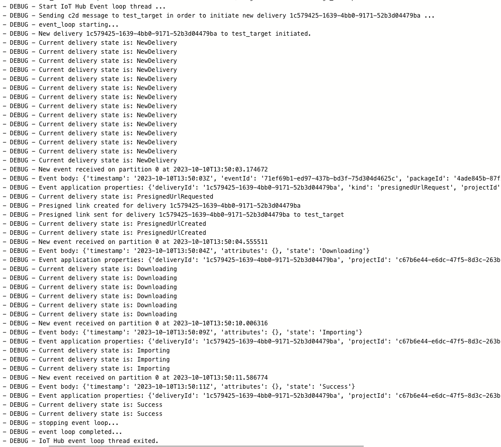

# Model Delivery

[[_TOC_]]

This document gives a brief overview of how the delivery process works and how we integrate it within our pipelines.

## Code Structure

The code for the delivery step can be split in two categories:
- python code that implements the functionality
- `.yml` configuration files used for the ADO pipelines

```tree
|-- .devops
|   |-- pipeline
|        |-- delivery_prod.yml
|        |-- platform_ci_dev.yml
|        |-- platform_pr_dev.yml
|-- mlops
|   |-- common
|       |-- components
|           |-- deliver.yml
|       |-- environment
|           |-- delivery_conda.yml
|       |-- pipeline
|           |-- delivery_pipeline.py
|           |-- pipeline_execution_utils.py
|       |-- src
|           |-- package_delivery.py
|           |-- package_delivery_mm.py
|   |-- config
|       |-- model_config.json
```


## How Model Delivery is Implemented

The model delivery step follows the packaging step, which prepares a `.zip` file that contains the ML model and all the additional files required for a successful execution on the Inference Server. The package is delivered to the AI Model Manager through IoT Hub by using the Event Hub messaging endpoint and a SAS link for the download of the package. The communication between Azure and AIMM is done through a loop that constantly updates the state of the delivery.

Below you can find detailed all the files involved in this process and the flow of the delivery.

### Files Involved

#### `package_delivery.py`

This file instantiates the ModelManager class, defined in `package_delivery_mm.py ` and initiates the delivery. ModelManager is a class that manages communication with AI Model Manager (= IoT Hub device) by using the IoT Hub and IoT Event Client Hub with the aim of generating a presigned link.

A summary of what functionality is implemented in this file can be found below:

- The following variables are retrieved:
    - Client secrets
    - IoT Hub Connection String -  Hostname of the IoT Hub used to authenticate a connection with IoTHub
    - IoT Event Hub Connection string -  A string containing the endpoint url for the endpoint in IoT Hub
    - Package from the model catalog
    - Datastore - retrieved from the URI address of the data asset where the package is stored
    - Blob_name - the blob where the package is stored

- ModelManager class is instantiated with:
    - iot_hub_con_str
    - iot_event_hub_con_str
    - Device id
    - Storage account -  retrieved from the datastore
    - Container name - retrieved from datastore as well
    - Blob name
    - Azure credentials

- The Event Hub Loop is started, which is a method of the ModelManager class

#### `package_delivery_mm.py`

In this file the ModelManager class is defined, which contains all the methods required for:
- All the methods used for C2D and D2C communication are defined
- Interpreting messsaging arriving from the Event Hub
- Starting and stopping the communication loop

The communication between IoT Hub and model registry is established with a **Registry Manager** (which sends events) and an **Event Hub Client** (which listens for and receives events). The events have a body and application properties.
Events are of 2 types.
- Type 1
   - body: `['timestamp', 'eventId', 'packageId']`
   - application: `['deliveryId', 'kind', 'projectId', 'type']`
- Type 2
   - body: `['timestamp', 'attributes', 'state']`
   - application: `['deliveryId', 'projectId', 'type']`

The IoTHub Registry Manager Service and Event Hub Consumer clients are instantiated.

The delivery_id, package_id, project_id and event_id are uniquely generated once and are internal to the ModelManager class.

The most important methods of this class are:

##### `start_event_hub_loop`
Initiates and manages the asynchronous communication with AI Model Manager by acting as a IoT Hub and IoT Event Hub client.

The following asynchronous functions are defined within this method:
-   `on_event` - asynchronous function is triggered when a new message is available on an Event Hub endpoint and processes the events that arrive from it by calling the `_process_event_hub_event` method
- `start_event_loop` -  the event hub client receives events from partitions using the defined `on_event` function as a callback which handles the received event
- `stop_event_loop` - terminates the connection with the consumer client

The loop is then started by with the following steps:
1. A thread process is created, which uses the asynchronous `run` method `asyncio.run`, which creates an event loop, runs a coroutine in the event loop and closes the thread when the coroutine is completed. This `run` method calls the `start_event_loop` method on the event hub client
2. The process is started by calling the `start` method on the thread object, `event_hub_thread`
3. The `_initiate_delivery` method is called, which generates a message, sets the properties of the message and sends it using the `registry_manager.send_c2d_message` method of the IoTHubRegistry manager
4.  Once this message is sent, the AIMM sends an event back that goes through the loop generated by the event_hub_thread object, which constantly listens for new events until the maximum time allowed elapses or the status of an event received is `Success` or `Error`. The maximum time allowed is set in the `_wait_until` method. This method also constaly checks for the status of the delivery at an interval of one second through the `_delivery_flow_completed` method (name is a bit deceiving)
5. The `join` method is then called which terminates the process

##### `_process_event_hub_event`
- Processes the events that arrive from EventHub
- Firstly, it checks that the `delivery_id` from the event matches the one for which delivery was initiated; if it doesn’t match, the processing stops
- If the `delivery_id` matches, based on the type of the event the following actions can be taken:
	- if `type` is `event` then an action is taken on cloud side:
        - the only action to be taken is sending a Presigned url link if the kind of the event is `presignedUrlRequest`
        - a presigned link is generated using the `_create_presigned_link` method
		- with this presigned link AIMM retrieves the package which is stored in the blob for which the SAS link was generated
		- this link is sent using the `_send_presigned_link` method
	- if the `type` is `state`, then the internal state of the application is changed to that of the application

##### `_create_presigned_link`
- Connects to the BlobServiceClient
- Generates a user delegation key with set expiration time
- Generates a SAS for the blob where the package is stored using the `generate_blob_sas` method Azure storage library
- Appends the SAS signature to the URL where is stored and returns the extended URL

### Sample Execution

Below you can find a sample of the logs recorded during the delivery process in AzureML. It contains events sent from and to IoT HuB, as well as the state of the delivery between each event.



## Pipelines where Delivery is Used

### `delivery_prod.yml`

This is a standalone delivery pipeline that is manually triggered. In ADO it is named **Standalone Delivery**. It receives a couple of inputs:
- deploy_env
- model_type
- model_name
- target_device_id
- edge_package_name
- edge_package_version

In this pipeline the variables from the `model_config.json` are read using the `templates/experiment_variables.yml` and added to the environment variables. Then an `AzureCLI@2` task is created and a job is launched in AzureML using the `mlops/common/pipeline/delivery_pipeline.py` file which calls the `package_delivery.py` script through the `deliver.yml` configuration file.

### `platform_ci_dev.yml` and `platform_pr_dev.yml`

These pipelines have 3 main stages:
- training
- packaging
- delivery

The delivery step is identical to the one in the **Standalone Delivery**, the only difference being that the inputs are automatically provided by the previous stages.
