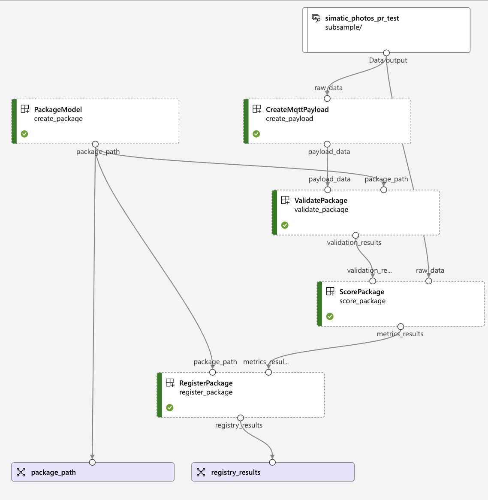
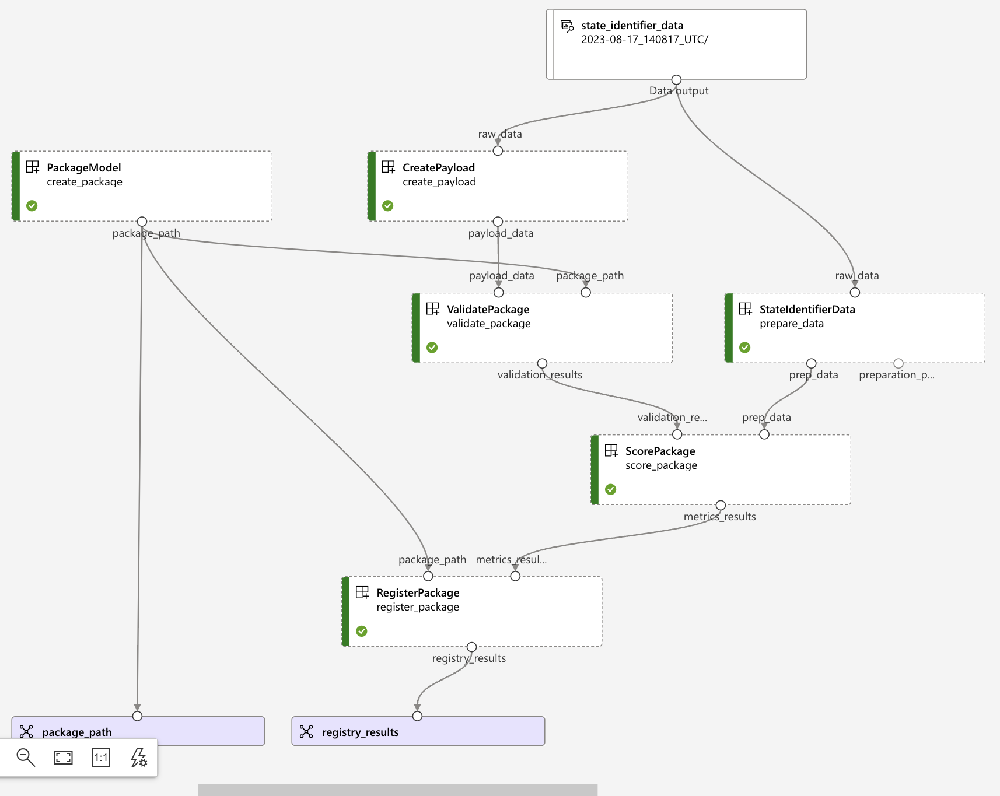

<!--
Copyright (C) 2023 Siemens AG

SPDX-License-Identifier: MIT
-->

# Model Packaging

- [Model Packaging](#model-packaging)
  - [Code Structure](#code-structure)
  - [Package model stage](#package-model-stage)
  - [MLOps packaging stages](#mlops-packaging-stages)
    - [Create payload data](#create-payload-data)
    - [Prepare data](#prepare-data)
    - [Create package](#create-package)
    - [Validate package](#validate-package)
    - [Score package](#score-package)
    - [Register package](#register-package)


This document gives a brief overview of how the packaging process works and how we integrate it within our pipelines.

## Code Structure

The code for the packaging step can be split in two categories:

- Python code that implements the functionality
- `.yml` configuration files used for the ADO and Azure ML pipelines

```tree
|-- .devops
|   |-- pipeline
|        |-- platform_ci_dev.yml
|        |-- platform_pr_dev.yml
|-- mlops
|   |-- common
|       |-- components
|           |-- package.yml
|           |-- register.yml
|           |-- validate.yml
|       |-- environment
|           |-- packaging
|               |-- conda.yml
|       |-- pipeline
|           |-- packaging_pipeline.py
|       |-- src
|           |-- package_registration.py
|           |-- package_validation.py
|   |-- config
|       |-- model_config.json
|   |-- image_classification
|       |-- components
|           |-- payload.yml
|           |-- prep.yml
|           |-- register.yml
|       |-- src
|           |-- package
|               |-- packaging.py
|               |-- payload.py
|               |-- vision_classifier.py
|               |-- score_package.py
|           |-- prep
|               |-- mqtt_payload.py
|               |-- prep.py
|   |-- state_identifier
|       |-- components
|           |-- payload.yml
|           |-- prep.yml
|           |-- score_package.yml
|       |-- src
|           |-- package
|               |-- entrypoint.py
|               |-- inference.py
|               |-- packaging.py
|               |-- score_package.py
|               |-- payload.py
```

## Package model stage  

The `package_model` stage follows the `execute_training_job` stage in both CI and PR Azure DevOps pipelines. In the PR pipelines this gets automatically triggered, while in the CI pipelines a manual approval is required in order to execute it.  
The packaging step creates a .zip file that contains the model itself and any libraries or dependencies required for a successful execution.  
This stage uses several variables, some of which are obtained from the outputs of the `execute_training_job` stage:

- `model_name`:  name of the model to package from Model Registry.
- `model_version`: version of the same model.

The job executes the Python script [packaging_pipeline.py](../../mlops/common/pipeline/packaging_pipeline.py), which creates and executes the required MLOps pipeline on Azure ML Workspace.

During the execution, the module

1) Logs into Azure using a Service Principal.
2) Obtains or creates a compute cluster to execute the MLOps job.
3) Creates a Python environment with `simaticai` for packaging.

The list of arguments used by the Python script is the following:

- `subscription_id`: Azure subscription ID.
- `resource_group_name`: Azure Machine Learning resource group name.
- `workspace_name`: Azure Machine Learning Workspace name.
- `cluster_name`: Azure Machine Learning cluster name.
- `cluster_size`: Azure Machine Learning cluster size.
- `cluster_region`: Azure Machine Learning cluster region.
- `min_instances`: Minimum number of instances for the cluster (default: 0).
- `max_instances`: Maximum number of instances for the cluster (default: 4).
- `idle_time_before_scale_down`: Idle time before the cluster scales down (default: 120 minutes).
- `build_reference`: Unique identifier for the Azure DevOps pipeline run.
- `deploy_environment`: Execution and deployment environment (e.g., dev, prod, test).
- `experiment_name`: Job execution experiment name.
- `display_name`: Job execution run name.
- `wait_for_completion`: Should the pipeline wait for job completion or not.
- `environment_name`: Azure Machine Learning Environment name for job execution.
- `conda_path`: Path to the conda requirements file.
- `env_description`: Description of the environment created using Conda.
- `model_type`: Type of the machine learning model used.
- `model_name`: Name used for the registration of the model.
- `model_version`: Version used for the registration of the model.
- `output_file`: File to save the run ID (optional).
- `package_name`: Name used for the registration of the created package.
- `raw_data`: Name of the raw data asset.
- `payload_data`: Path to the payload data to be created.

Once the job has been executed successfully, it will pass its outputs as environment variables:

- `package_name`: the name of the registered Edge Configuration Package.
- `package_version`: the version of the registered Edge Configuration Package.

## MLOps packaging stages

Overview of the Image classification packaging pipeline in Azure ML:



Overview of the State identifier packaging pipeline in Azure ML:



### Create payload data

Image classification:

- Python script located at `mlops/image_classification/src/prep/mqtt_payload.py`.
- Takes the raw data used for validation and converts it into a MQTT message that can be ingested by the inference server. This is usually a json format with different attributes, depending on the use-case​.

State identifier:

- Python script located at `mlops/state_identifier/src/prep/payload.py`.
- Reads raw data from a Parquet file, processes it by selecting specific columns ('ph1', 'ph2', 'ph3') and converting them into a list of records. The processed list is then saved to a file using compression.

### Prepare data

This step is only applied for the State Identifier use case, as in order to compute the metrics you need to transform the data by applying the transformation pipeline from the preparation step​.
The data preparation step represents the same step that is used in the MLOps training pipeline.

### Create package

This step takes all the files and compresses them into a .zip file​:

- gets the defined model from the Model Registry
- creates the Edge Configuration Package with the model specific Python script `mlops/{model_type}/src/package/packaging.py`

### Validate package

The validation step takes as input the payload data and package path and outputs the validation results.  
This step extracts the given package, reads the given payload data and with the help of a local pipeline runner it simulates the actions of the inference server and returns the predictions​.

### Score package

The 'score_package' step computes the same set of metrics used in the MLOps training pipeline in order to evaluate the performance of the model.

Image Classification:

- Python script located at `mlops/image_classification/src/package/score_package.py`.
- Extracts the labels from the initial data, reads and processes the validation results.
- The classification metrics (accuracy, precision, recall, F1-score) are computed using initial labels and validation results.

State Identifier:

- Python script located at `mlops/state_identifier/src/package/score_package.py`.
- 'score_package' step takes the validation results and the prepped data as input.
- Inertia and predictions are extracted from the validation results.
- 'dunn_index' and 'silhouette' metrics are then computed using the extracted predictions and the output from the 'prep_data' step.

### Register package

This step checks whether the `validate_package` job was successful, takes the Pipeline configuration package from the output of `create_package` job.  
In the case of a successful run the configuration package is converted to a deployment package and registered in the Model registry.
The package is registered in AzureML and tagged with the metrics of the model​.
