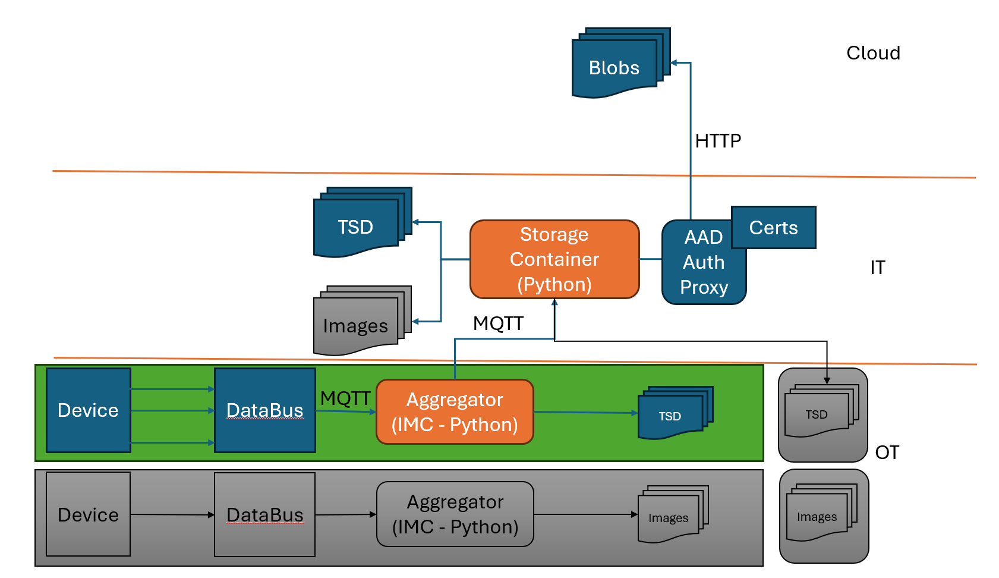

# Model Delivery

[[_TOC_]]

This document contains a list of ADRs that lay out all the decisions we made throughout the engagement regarding how model retraining should be implemented and possible ways forward. The solutions proposed here have not been implemented and only represent suggestions.

## Capturing Inference Data and Sending it to the Cloud

This ADR captures the discussion we had regarding the solution for Capturing Inference Data. We have identified 2 major components of this solution:
- **Data Aggregator** that sits in the OT layer
- **Storage Container** that sits in the IT layer



### Data Aggregator (OT -> IT)

This would be an extension of an existing tool that exists within the Siemens portfolio, IMC. Infrastructure Metric Connector (IMC) is an internal component of AI Model Monitor Agent, that allows metric collection from MQTT topics and API endpoints. This application sits in the OT layer within the devices' subnet and communicates directly with the DataBus through MQTT by subscribing to topics of interest. The DataBus in turn collects the data from field devices. There would be one DataBus and one Aggregator per device.

The **Aggregator** is meant to perform the following functions:
- Subscribe to inference data input and output MQTT topics from the DataBus
- Correlate in the inputs and outputs
- Store the inputs and outputs in the same parquet files (one row per correlated input and output) in local storage
- External MQTT endpoints that can communicate with the IT layer
- Once a certain dimension/time/number of items criteria is met the Aggregator would send the stored data to the IT layer through MQTT and the files storage system is cleared
- In the message sent to the Storage Container a device ID would have to be included for data aggregation

This IMC tool is Siemens IP and might be in breach of our agreement. We might not be able to have open access to the codebase and testing will be cumbersome as well. This functionality is already in the Siemens backlog so it will be outsourced to them, this part of the system will not be implemented in this engagement. We will make assumptions regarding the final structure of the parquet files to be sent. The programming language which will be used for this part of the application is Python.

### Storage Container (IT -> OT)

### Overivew

This custom container will sit in the IT layer. This container will implement the following functionality:
- Receive messages from the Aggregator through MQTT - many-to-one relationship, as multiple aggregators will send information to the Storage Container
- Store the files locally by using a store and forward method (need to investigate multiple avenues here to ensure that data will not be corrupted, overwritten, or lost)
- Be able to authenticate to Azure using a secure method (AAD proxy, IoT Hub)
- Send the data to the Blob Storage in the Cloud

#### Skeleton APP

The container will be written in Python and use custom code. A skeleton of the app would contain the following:
- MQTT client configuration
- MQTT client connection
- Subscription to topics
- Callbacks to write parquet files to local
- Authentication method for Azure
- Code for sending the data to the cloud using the [Blob Storage SDK](https://learn.microsoft.com/en-us/azure/storage/blobs/storage-quickstart-blobs-python?tabs=managed-identity%2Croles-azure-portal%2Csign-in-azure-cli)

#### Authentication Options

There are several authentication options that can be used:
- using the client details (Tenant ID, Client Secret and ID) and performing ```az login```
- deploying the container as an [Azure Blob Storage](https://hub.docker.com/_/microsoft-azure-blob-storage) container and deploying it as a module on a device registered in IoT Hub
  - this device can just be a VM on which the container runs; IoT Hub would then generate a SAS link that would allow the device to send data to the cloud
- using [AAD authentication proxy](https://github.com/Azure/aad-auth-proxy/blob/main/docs/getting-started/GETTING_STARTED.md)(preferred solution by Siemens)
  - this proxy adds Authorization header to http requests based on its configuration
  - it can be used to add authentication information to the requests made by scripts, tools, applications not designed to work directly with Azure Active Directory

#### Assumptions on messages received from the Aggregator

In order to go ahead with the development we will need to make some assumptions regarding how the messages from the Aggregator will look like. I propose the following json format:
```
{
   "topic": "ot_to_it/zip_file_transfer",
   "qos": 1,
   "payload": "Base64_encoded_zip_data_here",
   "metadata": {
      "file_name": "example.zip",
      "file_size": 1234567,  // Size in bytes
      "timestamp": "2023-09-01T10:30:00Z"
   }
}
```
We will assume that the zip file contains the data stored with the following folder structure:
```YYYY/MM/DD/HH/data.parquet```. As mentioned in the first section, each row of these parquet files will contain both the inputs and the outputs.

This format is a requirement for the Azure Drift monitor, as data can be ingested automatically by the tool only if it is stored in this format.

## Input Drift Monitoring

This section describes a proposed solution for monitoring input drift.

### Performance Degradation

Once a machine learning model is trained and deployed in production, there are two approaches to monitor its performance degradation: ground truth evaluation and input drift detection. 

Additionally, we can perform some checks on the train/test split for the state identifier use case to make sure that the distributions of the splits are similar enough.

#### Ground truth evaluation

- This would require waiting for the labels of the new data - only applicable to the image classification use case as state identifier is a clustering model; this involves following some metrics such as accuracy, F1 score, precision etc

#### Input Drift Detection

- A method that can be used for both the state identifier and image classification use case is the input drift detection
    - We can use some population metrics to determine whether there is a statistically significant difference between the data on which the model was trained and the new data used for inference
    - Data drift can occur because of 2 frequent root causes:
        - Sample selection bias, where the training sample is not representative of the population
        - Non-stationary environment, where training data collected from the source population does not represent the target population. 
    - Methods that can be used for input drift:
        - Drift detection in [AzureML](https://learn.microsoft.com/en-us/azure/machine-learning/how-to-monitor-datasets?view=azureml-api-1&tabs=python) - this is at the moment a preview and it is not recommended for production workflows yet (no SLAs)
        - Univariate statistical tests: for the state-identifier use case we can use the Kolmogorov-Smirnov test since all the features are continuous - best solution
        - Population Stability Index - can store the deciles in the data preparation phase and use them to compare the values from the newly acquired data, no need to use the entire dataset; has to be performed column-wise
        - Model Based approach for both use cases, training a model to identify that the inputs belong to the samples used for training or the incoming sample

We reached the conclusion that the best method for monitoring input drift detection is to use the Drift Monitor, as it will most likely enter GA in November 2023. We can trigger the input drift detector whenever new data becomes available.

The data used for training will be used as a baseline. This data can be used as-is, and consumed in the form of a Data Asset. The target data is the data against which inference will be performed. The target data will be represented by the data collected from inference. Inference data will be stored in a Blob Storage in the YYYY/MM/DD folder format. As such, there is no further need to have a timestamp column in the dataset as that will be inferred automatically from the folder structure. A sample implementation can be found in [this tutorial](https://learn.microsoft.com/en-us/azure/machine-learning/how-to-monitor-datasets?view=azureml-api-1&tabs=python).

The Data Drift monitor pipeline will be able to automatically update the target dataset using the folder structure whenever a scheduled job is run.  

If input drift is detected a notification e-mail has to be sent out which also includes the link to the dashboard. At the moment it only includes the results of a query on AppInsights.
