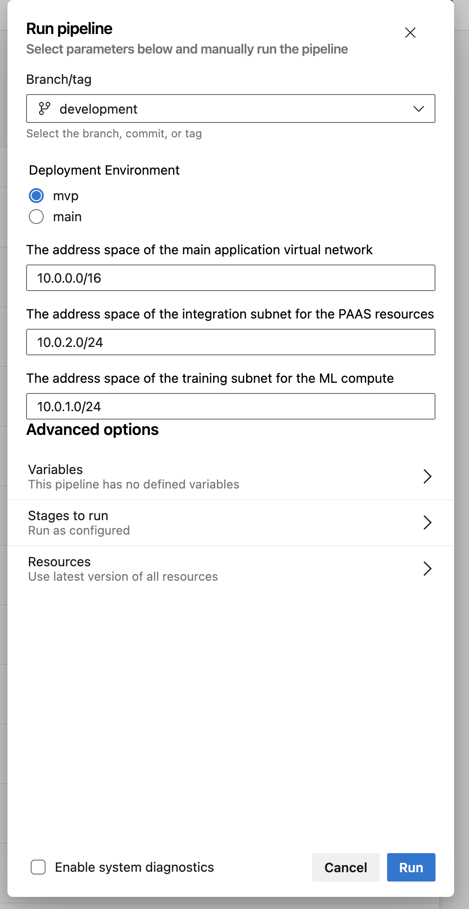

<!--
SPDX-FileCopyrightText: 2025 Siemens AG

SPDX-License-Identifier: MIT
-->

# Deployment

This document describes the deployment strategy for the Siemens Azure Enablement infrastructure.

To set up a new environment from scratch, the resources required by the Terraform backend configuration need to be setup by following the steps outlined in the [Terraform remote state document](terraform_remote_state.md).

*Note: This is a one time step when you are first deploying your configuration. It doesn't need to be done for any other subsequent deployment*.

## Deploying the infrastructure from a local environment
To deploy the infrastructure from a local environment, the following steps are required:

1) If not already created, create a service principal with at least `Contributor` rights to the subscription.

2) If not already set up, create the terraform remote state following the instructions outlined in the document referenced above.

3) Set up the environment variables found in `.devcontainer/devcontainer.env`
    - ARM_SUBSCRIPTION_ID: Subscription id from Azure Portal
    - ARM_TENANT_ID: Credentials for the Service Principal Authentication
    - ARM_CLIENT_ID: Credentials for the Service Principal Authentication
    - ARM_CLIENT_SECRET: Credentials for the Service Principal Authentication
    - LOCATION: Default deployment location (can be skipped)
    - TF_VAR_RESOURCE_GROUP_NAME: Terraform State Resource Group
    - TF_VAR_STORAGE_ACCOUNT_NAME: Terraform State Storage Account Name
    - TF_VAR_CONTAINER_NAME: Terraform State Container Name

4) Run the [deploy-infra.sh](/scripts/deploy-infra.sh) script to deploy the terraform modules. The infra-related tests can also be run from this script.

When deploying locally, resources can be deployed with or without a VNET. By default, resources are deployed without a VNET. To deploy with VNET enabled, the `--enable-vnet` option should be passed. For example

```
./scripts/deploy-infra.sh --action apply --enable-vnet
```

To see full usage of the deployment script, run `./scripts/deploy-infra.sh -h`.<br/><br/>


## Deploying the infrastructure from the CI/CD pipeline
Deploying the infrastructure to a more stable environment (main, mvp, staging etc) from Azure pipelines require a set of slightly different steps from a local environment deployment. Deployment is done majorly by triggering the [deploy_infrastructure](/devops/pipeline/deploy_infrastructure.yml). For first time deployment, the following steps are required:

1) If not already created, create a service principal with at least `Contributor` rights to the subscription.

2) If not already set up, create the terraform remote state following the instructions outlined in the document referenced above.

3) Setup the terraform environment variables in Azure pipelines. Variables used in Azure pipelines can be setup by going to `The Project Page > Pipelines > Library`, creating a variable group and adding the variables. The name of the variable group should tally with the one used in the yaml file. For example

    ```
    trigger: none

    variables:
    - group: vg-az-client
    ```

    The following variables are required to be set:
    - AZURE_SUBSCRIPTION_ID: Subscription id from Azure Portal
    - AZURE_TENANT_ID: Credentials for the Service Principal Authentication
    - AZURE_CLIENT_ID: Credentials for the Service Principal Authentication
    - AZURE_CLIENT_SECRET: Credentials for the Service Principal Authentication
    - TF_STATE_RESOURCE_GROUP: Terraform State Resource Group
    - TF_STATE_STORAGE_ACCOUNT_NAME: Terraform State Storage Account Name
    - TF_STATE_CONTAINER_NAME: Terraform State Container Name

4) If not already setup, setup the self-hosted agents needed to deploy the infrastructure and run the MLOps pipelines. Details on setting up the agents can be found in [this document about self-hosted agents](./self_hosted_agents.md). Once deployed, the VNET of the agent is peered with the VNET of the main infrastructure during deployment. This allows our pipelines to access our infrastructure securely even when behind a VNET.

5) Once setup, verify the correctness of the configuration for accessing the terraform remote state of the agents' VNET. This is important for the VNET peering to work correctly during deployment. This configuration is found in the `infrastructure > pipeline agent > remote-tfstate > main.tf` file.

6) Trigger the [deployment pipeline](/devops/pipeline/deploy_infrastructure.yml). Currently, the pipeline allows deployment to two environments - `mvp` and `main`. This can be modified to cater for more environments if necessary by simply updating the yaml file. The pipeline also receives three modifiable parameters for network IP configuration - ```the vnet address space```, ```the integration subnet address space``` and ```the training subnet address space```




### *Notes*
- The same [deployment script](/scripts/deploy-infra.sh) is used when deploying from either a local environment or the CI/CD pipeline.

- The pipeline adds two parameters to the script
    - **--enable-vnet** to ensure that the infrastructure is deployed with VNET enabled

    - **--peer-pipeline** to ensure that the VNET of the agents running the pipeline is peered with the VNET of the infrastructure. This is not necessary when deploying the infrastructure locally as the local environment does not use any agents.


### Help Center

**Deployment of the infrastructure failed due to an authorization request error.**

This is likely because the agent could not access the resource behind the VNET during create / update. Check that the agent's VNET is still peered and connected with the infra's VNET.


**An error occurred with running action on pipeline. E.g `jq package not found`.**

This is likely due to the specific ubuntu package not installed on the agent VMs. Update the `agent-init.sh` to install the missing package and redeploy the pipeline agents. The package should now be available on the agent VMs.


**An error occurred with creating one of the resources during deployment due to timeout.**

This is likely due to timeout issues with the terraform provider. Just re-run the deployment pipeline and the resource should be deployed / updated.
