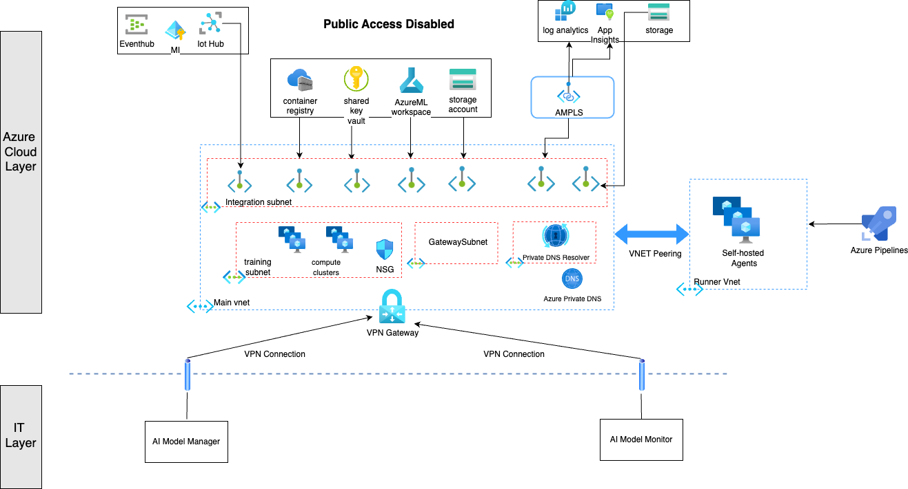

<!--
Copyright (C) 2023 Siemens AG

SPDX-License-Identifier: MIT
-->

# Introduction
This document describes the changes made to the infrastructure to improve network security of the resources deployed in the cloud. The architecture diagram below illustrates the different components, associated subnets, VNETs and resources introduced in the revised architecture.

## Infrastructure with Virtual Network Integration

### Virtual Networks (VNETs)
Two virtual networks are deployed

- The main VNET which houses the resources for the project.

- The runner / agents VNET which houses the self-hosted agents used for running the pipelines. The [self-hosted agents](./self_hosted_agents.md) are deployed in a VNET peered with the main VNET using VNET Peering. This allows us to deploy the infrastructure and also run the MLOps pipelines successfully.

### Subnets
The main VNET is divided into three subnets

- **Integration Subnet**: Contains the private endpoints for all the PaaS resources deployed (the ML Workspace, IoT Hub, Container Registry, Key Vault etc)

- **Training subnet**: Contains the compute cluster for training the models. The compute cluster also has a Network Security Group (NSG) attached to it to specify inbound and outbound network rules.

- **GatewaySubnet**: A specific subnet needed for the VPN Gateway.

- **Dns Resolver Subnet**: Used by the Azure Private DNS Resolver to create inbound endpoints. The inbound endpoint provides an IP address to forward DNS queries from personal computers or on-premise networks.

### Private Endpoints
Each PaaS resource exposes a private endpoint in the VNET. A private endpoint is described as an instance of that resource within a network. Each private endpoint is attached to an Azure Private DNS Zone attached to the network through a virtual network link.

*Note: The components of Azure Monitor (Log Analytics, Application Insights) do not expose individual endpoints. Instead, they all use a joint resource called an Azure Monitor Private Link Scope (AMPLS) which exposes the private endpoint on their behalf*

### Connectivity between Azure and On-premise Networks
To be able to connect devices (edge devices, personal computers) from the On-premise network to the Azure resources deployed behind the VNET in the cloud, a virtual network gateway is deployed. The virtual network gateway requires a specific subnet with name `GatewaySubnet` to be created. The VPN-based gateway creates two types of connections:

- A **site-to-site** connection which connects the on-premise network to the VNET through the use of a VPN Device.

- A **point-to-site** connection which connects personal computers to the VNET through the use of a VPN client installed on the PC. The step by step process on how to configure a VPN client is described in [VPN Connection Guide.](./vpn_connection.md). For a more comprehensive guide, visit [Microsoft Learn.](https://learn.microsoft.com/en-us/azure/vpn-gateway/point-to-site-vpn-client-cert-linux)

Once a VPN connection is established, the connecting device is assigned a private IP and can access the resources behind the VNET in the cloud through their respective private IPs.

An instance of Azure Private DNS Resolver is deployed to resolve the Azure Private Links from the on-premise network.
