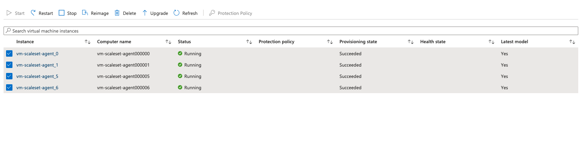

<!--
SPDX-FileCopyrightText: 2025 Siemens AG

SPDX-License-Identifier: MIT
-->

# Self-Hosted Agents
Self-hosted agents allow us to manage and customize the lifecycle, environments and dependencies of the agent software running the Azure DevOps pipelines. This project uses self-hosted agents primarily for two reasons

- To be able to deploy the infrastructure behind a VNET. This is particularly useful when updating an already deployed resource during `terraform apply`. For example, setting Key Vault permissions during deployment. The agents themselves are deployed in a VNET that is peered with the main application VNET, allowing them access to the resources.

- To be able to run the MLOps pipelines in the VNET. The MLOps pipelines use resources that are deployed behind the VNET. Microsoft-hosted agents are not able to access these resources but the self-hosted agents running on a peered VNET can.

## Setup
The terraform module for setting up the self-hosted agents is found in the `pipeline-agent` folder. This module is deployable on its own as seen in [this pipeline for deploying agents](../../devops/pipeline/deploy_pipeline_agents.yml). The agent software runs in a linux VM provisioned using a virtual machine scaleset. The agent software itself and associated dependencies are installed on the VMs using a virtual machine scaleset extension.

To setup new self-hosted agents, the following steps are required:

1) Create an agent pool in Azure DevOps by going to `Organization Settings | Project Settings > Pipelines > Agent Pools`

2) If not already setup, setup the terraform state resource group, storage account and container for deployment either manually or by running the terraform setup script.

3) On the Azure DevOps portal, create a Personal Access Token (PAT). For the scope, select Agent Pools (read, manage). This token is used in the [agent initialization script](../../scripts/agent-init.sh) for the agent registration.

4) Together with other required terraform variables, the Personal Access Token (PAT) and the agent pool created in step (1) should also be stored as pipeline variables in the variable group. The PAT is stored as `PIPELINE_AGENT_TOKEN` and the agent pool name is stored as `AGENT_POOL`.

5) Manually trigger the [pipeline](../../devops/pipeline/deploy_pipeline_agents.yml) to deploy the agent VMs on Azure.

6) Once deployed, upgrade the instances of the scaleset on Azure portal to ensure that the agents are running the latest version of deployments. The self-hosted agents are now ready to use in our pipelines.




## Sample Usage
Most of the pipelines in this project use the self-hosted agents from the agent pool. Below is an example of a snippet showing how the agent is used in a pipeline.

```
trigger: none

variables:
- group: vg-az-client

pool:
  name: $(AGENT_POOL)
```

The $(AGENT_POOL) is the name of the agent pool set as an environment variable in the `vg-az-client` variable group.
