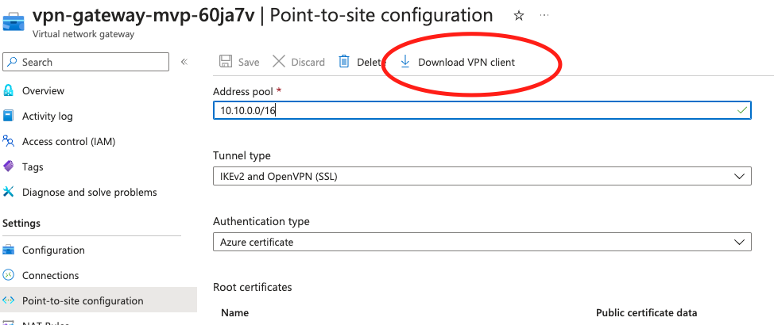
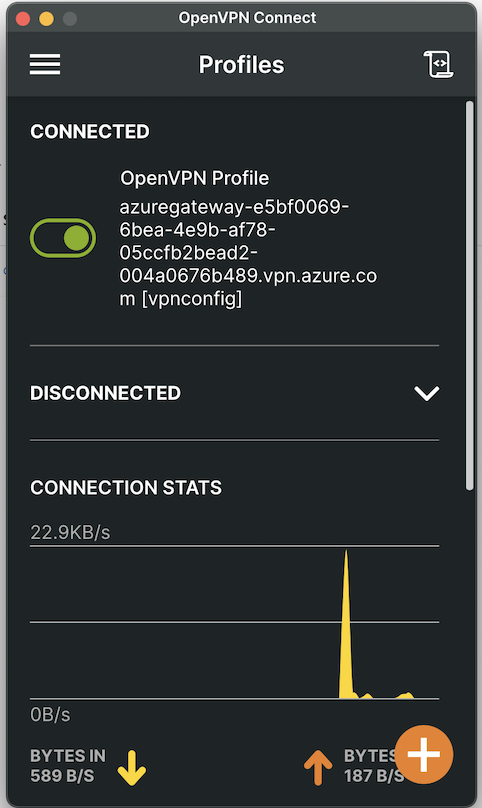

<!--
SPDX-FileCopyrightText: 2025 Siemens AG

SPDX-License-Identifier: MIT
-->

# Introduction
This document describes the process for setting up a VPN connection to access the Azure Resources deployed behind the VNET in the cloud. This document only describes the process for a Point-to-Site configuration.

## Prerequisites
Before proceeding with setting up the VPN connection, please ensure the following:

- The infrastructure is deployed in the cloud with the VPN gateway in place.

- A VPN client has been downloaded. Any VPN client supporting the OpenVPN or IkeV2 protocol can be used but a popular choice for testing is the [official OpenVPN client.](https://openvpn.net/client/)

## Connection Setup
1) Download the skeletal file for the vpn configuration from Azure portal. The downloaded file is a zip file containing the configurations for different clients. 

2) Unzip the downloaded file and using a text editor or IDE, open the `vpnconfig.ovpn` file from the OpenVPN folder. This file should already contain some configurations including the CA root certificate created with terraform!

3) Comment out the line containing the log command.

```
# log openvpn.log
```

4) Add the following line to the configuration to include DNS configuration where x.x.x.x is the IP address of the inbound endpoint for the private DNS resolver (e.g 10.0.3.4)
```
dhcp-option DNS x.x.x.x  
```

5) Populate the client certificate and client key. This can be gotten from the output of terraform. Since this is a sensitive output, the raw value can only be accessed from the terraform state file.

6) The configuration file is now ready to be used with the OpenVPN client. A successful connection should look like the one below.

