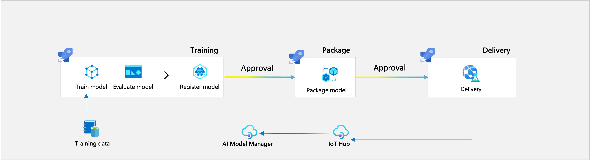

# MLOps Training Pipeline

[[_TOC_]]

This document gives a brief overview of all the processes and files involved in the MLOps training pipelines. In this engagement we have developed 2 use-cases: _State Identifier_ and _Image Classification_. They both share the same structure, which contains the following stages:

- Data Preparation
- Training
- Scoring
- Registration

## Code Structure

All the code can be found in the `mlops` folder of the repository. The code is structured as follows:
- `common` - contains all the code that is shared between the use-cases and the one used for `packaging` and `delivery`
- `image_classification`/`state_identifier` - contains the code for the image classification / state identifier use-cases
    - `components` - contains the code for the `.yml` files used in the pipeline
    - `environment` - contains the configuration file for the conda environment used in the pipeline
    - `src` - contains the code for the `.py` files used in the pipeline
    - `pipeline` - contains the code for the pipeline itself, `mlops_pipeline.py`

## Machine Learning Flow

## mlops_pipeline.py

This python file handles the creation of the pipeline components and the execution of the pipeline. The `main` function parses the arguments received from the `.variables_template.yml` stage and passes them to the `prepare_and_execute` function.

In the `prepare_and_execute` function the compute clusters and execution environment are created/updated. The compute cluster is assigned using the `get_compute` function and the execution environment is assigned using the `get_environment` function. Both are defined in the `common` folder. The `construct_pipeline` function is called, which loads all the necessary [components](https://learn.microsoft.com/en-us/azure/machine-learning/concept-component) and data assets. This function also call `image_classification_job`/`state_identifier_data_regression`, which creates the structure of the pipeline, as indicated by the `@pipeline` decorator. The `execute_pipeline` function is then called, which executes the pipeline and waits for its completion.

The input data is stored as [Data Assets](https://learn.microsoft.com/en-us/azure/data-catalog/data-catalog-how-to-manage), which support versioning. These **Data Assets** can be accessed in AzureML by clicking on the **Data** tab in the **Assets** section.

### Components

In the `prepare_and_execute` function the components of the pipeline are created:

- `prepare_data`
  - called by the `prep.yml` config file
  - implements the code from `prep.py`
- `train_with_data`
  - called by the `train.yml` config file
  - implements the code from `train.py`
- `score_with_data`
  - called by the `score.yml` config file
  - implements code from `score.py`
- `register_model`
  - called by the `register.yml` config file
  - implements code from `register.py`

The pipeline has several return values that can be further used. These are then downloaded and used in downstream processes such as packaging and delivery.

### Stages

The pipeline has 4 stages that are executed sequentially and shared by the image classifcation and state identifier use-cases. In this section we will go through each stage and provide a brief explanation of what it does.

#### Prepare Data

This stage is used for data preparation. It takes the input data from the **Data Asset** and performs some transformations on it. These transformations are use-case specific:

In the *state identifier* case a sklearn data preparation pipeline is created which applies a series of transformations to the data, including filling missing values, summarizing columns, windowing, feature extraction, and scaling. This pipeline is then saved as a `joblib` file and uploaded to Blob Storage along with the transformed data and used as inputs for further steps.

In the *image classification* case the data is split into training and testing sets. The training set is then used to train the model and the testing set is used to evaluate the model. The data is then uploaded to Blob Storage and used as inputs for further steps.

#### Train with Data

In this stage a model is trained with the data prepared in the previous stage. The model used in the *state_identifier* use case uses the entire dataset, whereas the one for *image classification* uses only the training set. The model is logged with `mlflow` and then saved to a file and uploaded to Blob Storage. 

#### Score with Data

This stage is used to evaluate the performance of the model. In the *state identifier* use-case the model is unsupervised so the same data used to train the model will be used to evaluate it. In the *image classification* use-case unseen testing data is used to evaluate the model. The results are logged with `mlflow` to AzureML and then saved to a file and uploaded to Blob Storage.

#### Register Model

In this stage the model is registered in AzureML with `mlflow`. In the *state identifier* use-case the data transformation pipeline and the trained K-means model are sequenced in a new sklearn pipeline and registered as a single model. In the *image classification* use-case the trained model is registered as is. 