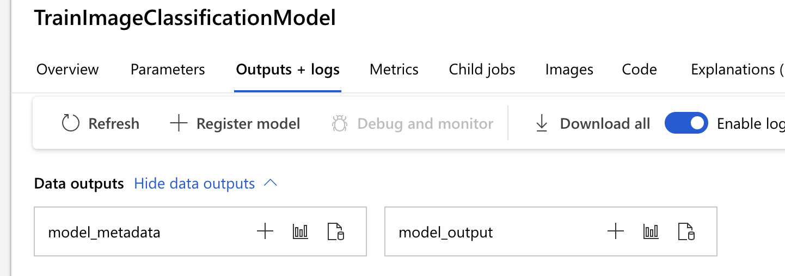

# Testing AzureML Pipelines and Components

[[_TOC_]]

This document is referring to the contents of the following `mlops` folder.

Testing the MLOps components locally is a different endeavour from unit-testing. Testing them locally as described in this document ensures that your code runs as expected, which can be a bit more cumbersome when dealing with AzureML, as in this particular case. Unless you are employing test driven development, these local tests would be executed before the unit tests.

### Pre-requisites

In order for the tests to execute correctl you need to set up the execution environment. If you are not testing in a Docker environment with the correct requirements installed you should install the requirements stored in `.devcontainer/requirements.txt`, preferably in a virtual environment. The command would look as follows:
`pip install -r .devcontainer/requirements.txt`. Some packages might not install due to incompatibility with the OS or CPU architecture that you are using, for which you will need to find a workaround.

The next step is logging into Azure from the CLI with `az login` using the credentials and the method that would be used in the production code as well. Make sure that the credentials used match the ones used in the AzureML workspace in which you are deploying.

### Testing the Components

This applies to the following files in the `mlops/{use-case}/src` directories.

Once the pre-requisites are completed, in order to test locally the each of the components it's sufficient to call the python script with the correct parameters, an example can be found below:

```
python azure-enablement/mlops/image_classification/src/score/score.py --model azure-enablement/mlops/image_classification/src/train --test_data azure-enablement/mlops/image_classification/src/train/simatic_photos --score_report azure-enablement/mlops/image_classification/src/score
```
For local testing, most inputs will not be readily available in the repository so you will need to download outputs of previous stages from AzureML or create some sample inputs yourself. You need to make sure that the inputs you use will have the same properties as the ones used in production. Since most of the work in the training part of a ML pipeline will be sequential, the best source for an input for a stage will be the outputs of the previous stages. These can be downloaded from AzureML by clicking on the stage, selecting `Outputs+logs -> Show data outputs` and the downloading the files from Blob Storage. Once downloaded, they can be used as inputs for local testing. An example of how would look in the UI can be found below:




### Testing the Entire Pipeline

This section would test the pipeline as a whole, including all the `.yml` files, `mlops_pipeline.py` and all the scripts in the `src` folder. In order to launch the pipeline with an AzureML you need to run the following command with the correct parameters:
```
python -m mlops.${model_type}.pipeline.mlops_pipeline
                --subscription_id $subscription_id
                --resource_group_name $RESOURCE_GROUP_NAME
                --workspace_name $WORKSPACE_NAME
                --cluster_name $CLUSTER_NAME
                --cluster_size $CLUSTER_SIZE
                --cluster_region $CLUSTER_REGION
                --build_reference $CI_JOB_ID
                --deploy_environment ${env_name}
                --experiment_name $EXPERIMENT_NAME
                --display_name mlops_$DISPLAY_NAME
                --wait_for_completion True
                --environment_name $ENVIRONMENT_NAME
                --env_base_image_name $ENV_BASE_IMAGE_NAME
                --model_name $MODEL_NAME
                --conda_path $CONDA_PATH
                --output_file run_id.txt
                --asset_name $ASSET_NAME
```

This will launch a job in AzureML which can be monitored in the UI.
