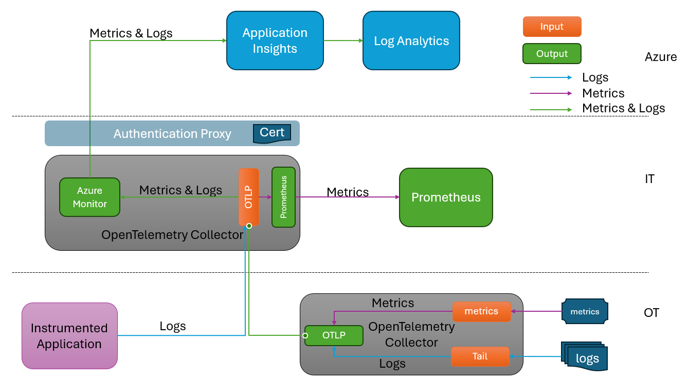

<!--
SPDX-FileCopyrightText: 2025 Siemens AG

SPDX-License-Identifier: MIT
-->

# Observability Architecture

## Requirements

During the engagement's Phase 2 ADS sessions, the following set of requirements were defined for the observability architecture:

1. No custom software components in the factory
1. No custom software components in Azure
1. Strong authentication from factory to cloud
1. Maintain existing in-factory Prometheus connectivity
1. Logs and metrics to follow the same path to Azure Monitor
1. Logs and metrics data should be persisted to disk in the case of network failure and resent upon reconnection
1. No shared authentication secrets in IT layer
1. Minimise data-loss in the case of network interruption or application downtime

The Phase 1 architecture that included an Azure Function for logs data does not satisfy these requirements. This was required in Phase 1 due to a bug in the Azure Monitor Exporter component in the OpenTelemetry Collector. The bug was reported and fixed during Phase 2 allowing us to drop the Function and route both logs and metrics through the OpenTelemetry Collector.

## Solution

The final Phase 2 Observability Architecture can be seen in the following image:

The architecture uses OpenTelemetry Collector (OTelCol) in both the OT and IT layers with the OTLP protocol for data transfer between them.

The OT instance of OTelCol collects logs and metrics data from files written by the application/models running on the factory floor. Although not shown in the image, it could act as a relay for any Instrumented Applications wishing to send telemetry via the OLTP protocol if they do not have direct network access to the OTelCol instance in the IT layer.

The IT instance of OTelCol receives logs and metrics from the OT layer via an OLTP importer. The data is passed to the Azure Monitor Exporter for sending to Azure and it also uses the Prometheus Exporter to copy metrics data to the in-factory Prometheus instance.

## Well Architected Framework Considerations

The following sections consider how this solution fits with the principles defined in the [Well Architected Framework](https://learn.microsoft.com/en-us/azure/well-architected/).

### Security

The OTelCol's built-in mTLS authentication is used to authenticate the connectivity between OT and IT layer instances.

The Azure Monitor Exporter in the IT layer uses an AAD (Entra ID) based identity to authenticate to Application Insights (appInsights) in Azure. AppInsights is used as the ingestion point to Azure Log Analytics, the final resting place of the data. Neither OTelCol nor Azure Monitor Exporter does not natively support AAD based authentication. To overcome this, the [AAD Authentication Proxy](https://github.com/Azure/aad-auth-proxy) is used. This is provided a certificate that represents the AAD App Registration associated with the Azure Monitor Exporter. This allows it to import data to AppInsights securely. The process for the generation and distribution of this certificate can be found in the [AI Model Monitor Certificate Generation](../certificates/ai_model_monitor_certificate_generation.md) documentation.

In Azure, AppInsights has its `Local Authentication` setting turned off. This means it is no longer sufficient to simply have the Instrumentation Key to import data. It is still necessary to have the Instrumentation Key, but you also need an AAD identity that has the `Monitoring Metrics Publisher` role defined on the AppInsights instance. This means that the Instrumentation Key is no longer a shared secret, hence is compliant with Requirement 7.

### Reliability

At each point in the system where there is a network step, the system needs to be able to cope with temporary network loss or application downtime. These are:

- OT OTelCol reading local telemetry files
- OT OTelCol -> IT OTelCol connectivity
- IT Azure Monitor Exporter -> Authentication Proxy
- Authentication Proxy -> Application Insights

We will consider each of these situations in turn:

#### OT OTelCol Downtime

Should the OT layer instance of OTelCol be down for any length of time, the telemetry data written by the applications/models continues to build up on the local disk and will be read when it restarts, therefore there is no data-loss.

#### OT -> IT Network Failure

Should there be a network break between the OT and IT layers, the OTelCol in the OT layer will store telemetry data in memory until the connection is restored and will then transmit the data to catch up. It is also possible to persist this data to the local disk should this be desired.

#### Azure Monitor Exporter -> AAD Authentication Proxy

If the Authentication Proxy is not running or returns 50x HTTP results, the Azure Monitor Exporter will buffer the data in memory and retry later. Enhancements were made to the Exporter as part of this engagement to support the same disk based queue persistence used in the OTLP exporter, so the data can be safely stored for later resending.

#### AAD Authentication Proxy -> Application Insights

Should the link from the Auth Proxy to AppInsights be unavailable, the Proxy will return a 503 result to the Azure Monitor Exporter, which then stores the data and goes into a retry cycle.

### Cost Optimisation

The primary cost driver in this solution is the storage of data in Log Analytics. This is configured to the default 30 day lifetime with no archive period.
