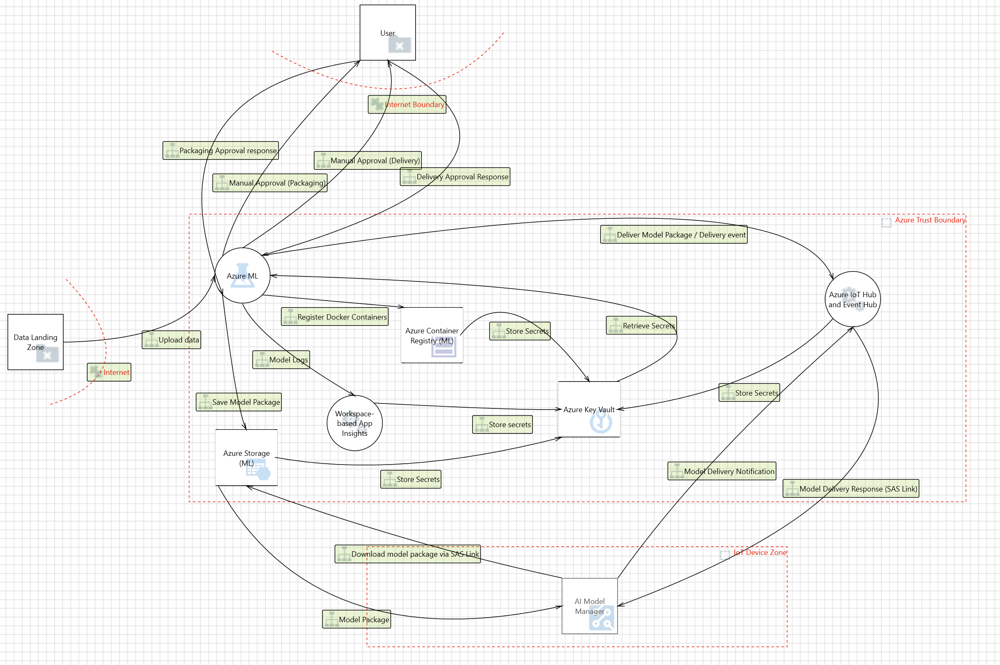
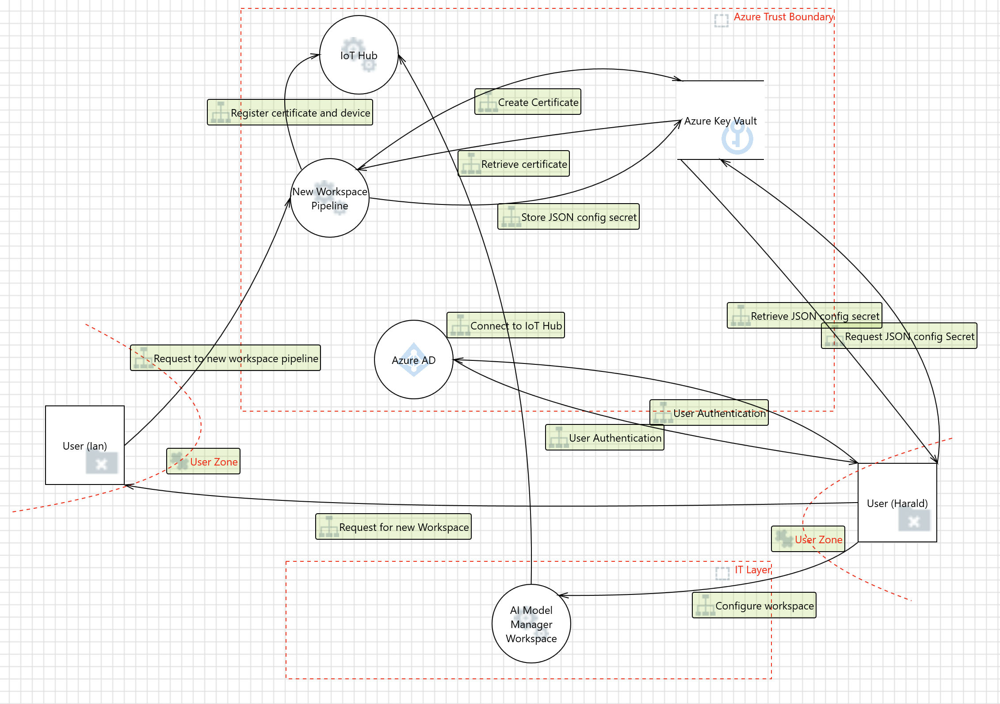
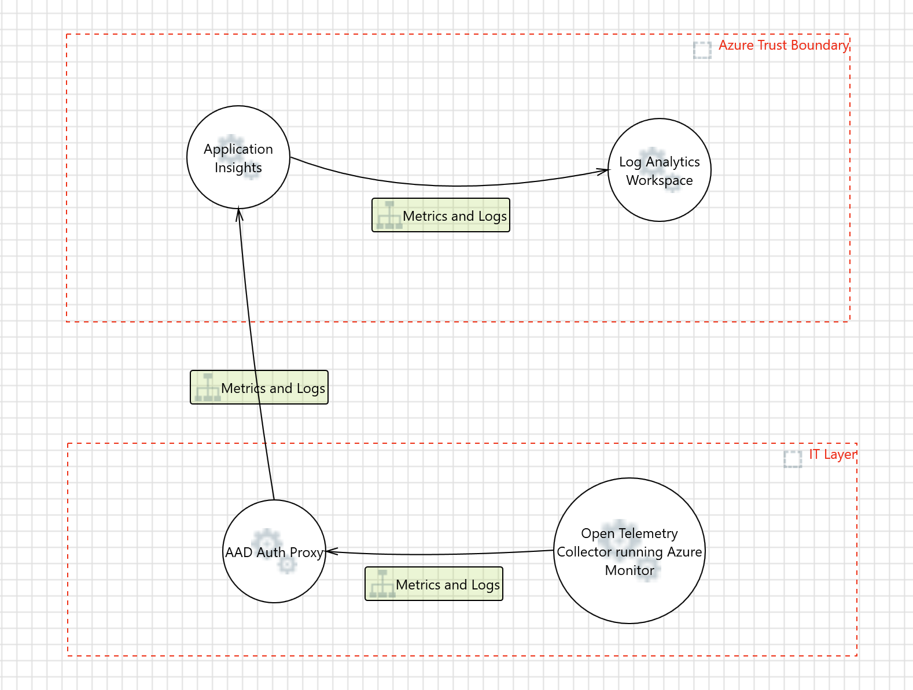
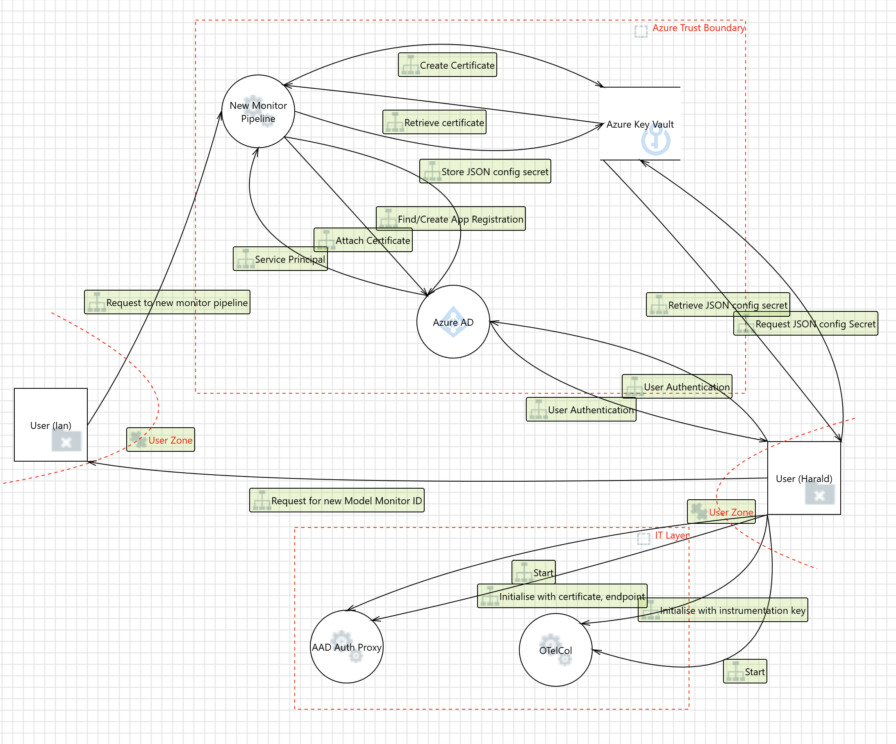

# Threat Modeling

This folder contains the data flow diagrams created using the [Microsoft Threat Modeling Tool](https://learn.microsoft.com/en-gb/azure/security/develop/threat-modeling-tool). In order to view / edit the diagrams or the generated list of threats you need to open these models inside the tool.
The list of threats is also documented on the project's ADO wiki for planning purposes.

The list data flow scenarios for the current system is:

- MLOps and E2C/C2E communication using IoT Hub

- IoT Hub certificate management

- Metrics and Logs

- Authentication Proxy certificate management

