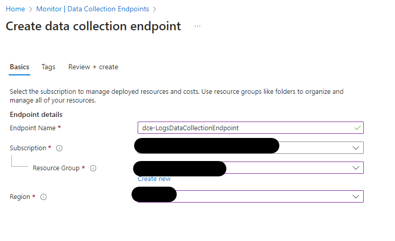
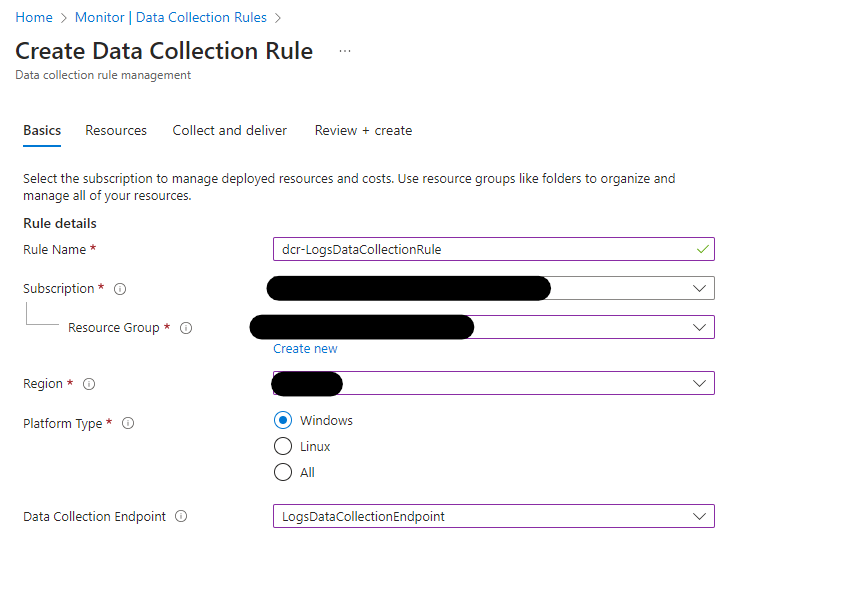
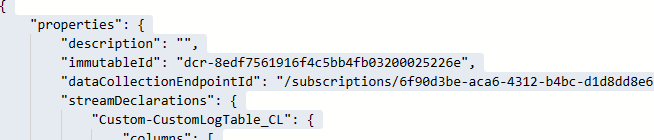
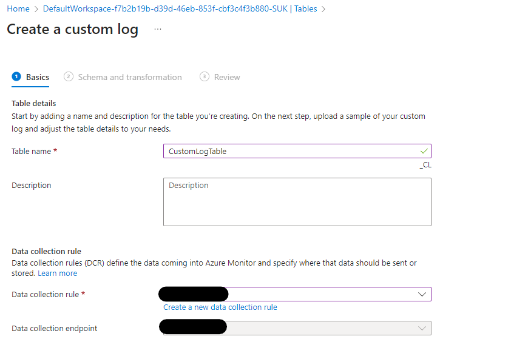
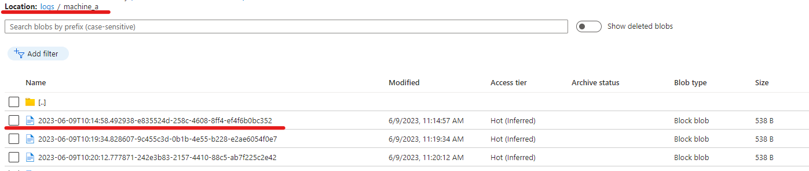

<!--
Copyright (C) 2023 Siemens AG

SPDX-License-Identifier: MIT
-->

# Logs Function

[[_TOC_]]

This Azure Function accepts log data posted to it, writes the data to blob storage and then writes the data to Log Analytics.

## Endpoint

The endpoint is

POST ~/api/logs

## Required headers

The following headers are required:

| Header | Type | Description |
|--------|------|-------------|
| x-logs-source | string | Name of the machine this set of logs comes from.|
| x-arr-log-id | GUID (as string) | Unique message id. OTelCol adds this automatically. You need to add it if calling from Postman or elsewhere. |

These two values are used to compose the name of the blob {source}__{message_id}. They will be written into a container called ```logs```.

## Environment Variables

The function's code expects there to be an Environment Variable set

| Env Var | Description |
|---------|-------------|
| LOGS_KEY_VAULT_URL | The full URL of the Key vault holding the storage account  connection string |
| STORAGE_CONNECTION_STRING_SECRET_NAME | Name of the secret holding the connection string to the storage account |
| LOG_ANALYTICS_DCR_IDENTIFIER_NAME | Name of the Log Analytics Data Collection Rule Identifier secret to read from Key Vault |
| LOG_ANALYTICS_TABLE_NAME | Name of the table in Log Analytics to write the data to. As it appears in the Azure Portal.|
|LOG_ANALYTICS_ENDPOINT_NAME | Name of the Log Analytics ingestion endpoint secret to read from Key Vault. |

## Key Vault Secrets

The Key Vault pointed to by the LOGS_KEY_VAULT_URL env var, should contain the following secrets

| Secret | Description |
|--------|-------------|
| kv-metlog-storage-account-connection-string | The connection string of the storage account to write the logs to.|
| log-analytics-dcr-identifier | The immutable identifier of the DCR generated to accept logs. Will look something like ```dcr-d166edd82b164139952e00f02497e543```|
| log-analytics-ingestion-endpoint | Full URL of he Log Analytics Ingestion endpoint |

## Key Vault Permissions

The Service Principal that is the managed identity of the Function App requires the ```Key Vault Secrets User``` permission on the key vault pointed to by the ```LOGS_KEY_VAULT_URL``` environment variable.

## Storage Permissions

The Service Principal that is the managed identity of the Function App requires the ```Storage Blob Data Contributor``` permission on the storage account pointed to by the ```kv-metlog-storage-account-connection-string``` KeyVault secret.

## Additional Azure Resources

### Endpoint

The Azure Monitor in the subscription needs a "Data Collection Endpoint" to be added. The following image shows how it would be created in the Azure Portal. The same needs to be added to the Terraform Modules.



The name doesn't matter but should be meaningful.

The Subscription and Resource group should be the ones used by the rest of the Terraform modules.

The Region should be the same as that used for the Log Analytics Workspace.

The Logs Ingestion endpoint needs to be saved into the KeyVault as the ```log-analytics-ingestion-endpoint``` secret.

### Data Collection Rule

Once the Data Collection Endpoint has been created, we need a Data Collection Rule. The following figure shows how it should be configured in the Azure Portal. This needs to be created in a Terraform Module



The name doesn't matter but should be meaningful.

The Subscription and Resource group should be the ones used by the rest of the Terraform modules.

The Region should be the same as that used for the Log Analytics Workspace.

Platform doesn't seem to matter, leave as Windows. It might be possible to use the other options instead of Windows, but this is untested.

The Data Collection Endpoint is the one created in the last step.

The managed identity of the function app will need the "Monitoring Metrics Publisher" permission on the DCR.

Once the resource has been created, its Immutable Id needs to be saved into KeyVault as the ```log-analytics-dcr-identifier``` secret



### Custom Log Table

Once the Data Collection Endpoint and Data Collection Rule have been created we need to create the Custom Table in Log Analytics that the data will be written to.

In the Azure Portal, this is a multi-step process. The following figure shows the DCR-based table creation screen in the Azure Portal, this needs to be replicated using the Terraform Modules:



Select the Data Collection Rule created above, this requires the Data Collection Endpoint created above as well. In the Portal this is automatically selected.

The next step is to define the schema for the table. The json file for this can be found [here](schema.json).

Then a transformation needs to be added to convert the Timestamp in the log data to the dateTime type recognised by Log Analytics

```
source
| extend TimeGenerated = todatetime(Timestamp)
```

This should allow the creation of the table in LogAnalytics.

The name used to create the table should be written to the ```LOG_ANALYTICS_TABLE_NAME ``` environment variable on the Function App.

This cannot be achieved using Terraform, it looks like you need to use the Azure CLI to create a custom log table.

## Blob structure

When logs are sent to the Function, they are first written to blob storage then processed and written into Log Analytics.

A simple 'folder' structure is applied:

```
/logs/{x-logs-source}/{UTC timestamp}-{x-arr-log-id}
```

The timestramp value in the name is the time the Blob was written and is independent of the timestamps of the logs inside the blob.

For example




## Data Format

The function expects data to be sent to it from Fluent-Bit HTTP Output in JSON format.

An example can be seen here

```json
[
  {
    "date": 1686655026.344064,
    "log": "[2023-05-23T00:01:56.449Z] [Log] [I] [thread 724] [inference] Status has been changed. Pipeline ID: f6c7374b-90fb-4cd8-becb-227cbcf45197:1.0.666, Name: inference, Status: Running"
  },
  {
    "date": 1686655026.344068,
    "log": "[2023-05-23T00:01:57.466Z] [Log] [I] [thread 724] [inference] Status has been changed. Pipeline ID: f6c7374b-90fb-4cd8-becb-227cbcf45197:1.0.666, Name: inference, Status: Waiting"
  },
  {
    "date": 1686655026.34407,
    "log": "[2023-05-23T00:13:12.793Z] [Log] [I] [thread 724] [inference] Status has been changed. Pipeline ID: f6c7374b-90fb-4cd8-becb-227cbcf45197:1.0.666, Name: inference, Status: Running"
  }]
  ```

  Only the "log" component is used in the function as this contains its own timestamp.

The function can now handle a broader range of log file formats than it's initial implementation. There are a number of regular expressions that are used by parser classes to try to build the log messages sent to Log Analytics. Details can be found in the /src/functions/log_function/log_parsers codebase.
